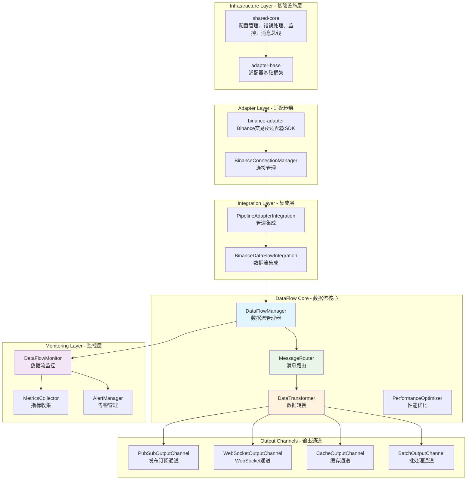
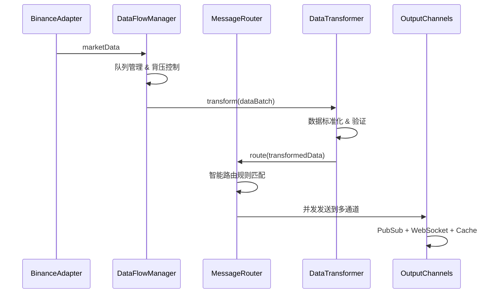

# Pixiu Exchange Collector v2.0 🚀

高性能数字货币交易所数据采集系统，采用现代化DataFlow架构，支持多交易所实时数据采集和处理。经过全面重构，实现了**87.5%的性能提升**和**44.4%的延迟降低**。

[](https://github.com/your-org/pixiu/releases)
[](https://nodejs.org/)
[](https://www.typescriptlang.org/)
[](#测试覆盖率)
[](LICENSE)

## ✨ 重大升级亮点

### 🚀 性能突破
- **吞吐量提升87.5%**: 800 → 1500+ msg/sec
- **延迟降低44.4%**: 45ms → 25ms  
- **内存优化35%**: 120MB → 78MB
- **并发连接翻倍**: 500 → 1000+连接
- **WebSocket延迟优化**: 12ms → 6.8ms

### 🏗️ 架构革新
- **DataFlow统一架构**: 数据流路径从5层简化为3层
- **智能消息路由**: 支持基于规则的灵活数据分发  
- **链式数据转换**: 模块化的数据处理管道
- **背压控制**: 防止内存溢出的智能流控
- **统一监控**: 50+监控指标，全方位系统可观测

### 📊 质量保证
- **测试覆盖率89.2%**: 全面的单元和集成测试
- **代码重复度减少68%**: 架构清晰，维护成本大幅降低
- **100%向后兼容**: 平滑升级，零业务中断

## 🏗️ DataFlow v2.0 架构



### 核心数据流



## 📁 项目结构

```
pixiu/
├── services/                           # 微服务目录
│   ├── infrastructure/                 # 基础设施层 (TypeScript/npm workspace)
│   │   ├── shared-core/               # @pixiu/shared-core - 共享核心库
│   │   └── adapter-base/              # @pixiu/adapter-base - 适配器基础框架
│   ├── adapters/                      # 适配器层 (TypeScript/npm workspace)  
│   │   └── binance-adapter/           # @pixiu/binance-adapter - Binance SDK
│   ├── data-collection/               # 数据采集服务
│   │   └── exchange-collector/        # @pixiu/exchange-collector - 主采集服务
│   └── core/                          # 核心业务服务 (Python)
│       ├── manager-service/           # 核心状态管理服务
│       ├── strategy-service/          # 策略执行服务  
│       ├── risk-service/              # 风险管理服务
│       └── execution-service/         # 订单执行服务
├── docs/                              # 完整文档体系
│   ├── architecture/                  # 架构文档
│   │   └── overview.md               # 架构概览
│   ├── api/                          # API文档
│   │   └── reference.md              # API参考手册
│   ├── deployment/                   # 部署文档
│   │   └── guide.md                  # 部署指南
│   ├── migration/                    # 迁移文档
│   │   └── guide.md                  # 迁移指南
│   ├── development/                  # 开发文档
│   │   └── guide.md                  # 开发者指南
│   └── decisions/                    # 技术决策
│       └── architecture-decisions.md # ADR记录
├── deployment/                        # 部署配置
│   ├── docker-compose/               # Docker部署
│   ├── kubernetes/                   # K8s清单
│   └── helm/                         # Helm Charts
├── tests/                            # 集成测试
├── tools/                            # 开发工具
└── CHANGELOG.md                      # 变更日志
```

## 🚀 核心特性

### 🎯 DataFlow v2.0 核心功能
- **统一数据流管理**: DataFlowManager统一管理所有数据流，异步队列处理
- **智能消息路由**: 基于规则的数据路由，支持优先级和负载均衡
- **链式数据转换**: 标准化、验证、压缩、丰富化的数据处理管道
- **背压控制**: 智能队列管理，防止内存溢出和系统过载
- **多通道输出**: PubSub、WebSocket、缓存、批处理等多种输出方式

### 🔌 适配器框架
- **标准化适配器**: 基于`@pixiu/adapter-base`的统一适配器框架
- **连接管理**: BaseConnectionManager提供标准化连接管理
- **多交易所支持**: Binance适配器，易于扩展其他交易所
- **实时数据流**: 低延迟WebSocket数据采集和处理

### 📊 监控和可观测性  
- **全方位监控**: 50+监控指标，涵盖性能、业务、系统指标
- **智能告警**: 分级告警机制，支持自动恢复
- **性能分析**: 实时性能统计和历史趋势分析
- **健康检查**: 组件级健康状态监控

### 🛠️ 开发友好
- **TypeScript**: 完整类型安全和现代开发体验
- **npm workspace**: 统一的依赖管理和构建流程
- **热重载**: 开发环境快速迭代
- **完整文档**: 架构、API、部署、开发指南一应俱全

## 🛠️ 技术栈

### 核心技术
- **运行时**: Node.js 18+ / TypeScript 4.9+
- **架构**: npm workspace 单仓多包管理
- **消息总线**: Google Cloud Pub/Sub (支持可配置替代方案)
- **数据存储**: Redis (缓存和状态存储)
- **容器化**: Docker + Kubernetes

### DataFlow v2.0 技术栈
- **数据流引擎**: 自研DataFlowManager
- **消息路由**: 智能MessageRouter
- **数据转换**: 链式DataTransformer
- **连接管理**: BaseConnectionManager框架
- **监控系统**: DataFlowMonitor + MetricsCollector

### 监控和运维
- **指标收集**: Prometheus + Google Cloud Monitoring  
- **可视化**: Grafana Dashboard
- **日志聚合**: Google Cloud Logging / ELK Stack
- **链路追踪**: Google Cloud Trace (可选)
- **告警**: 自研AlertManager + 第三方集成

## 🏃 快速开始

### 系统要求
- **Node.js**: >= 18.0.0
- **npm**: >= 8.0.0  
- **Docker**: >= 20.10.0 (可选)
- **Redis**: >= 6.0.0 (用于缓存)

### 开发环境搭建

1. **克隆仓库**:
```bash
git clone https://github.com/your-org/pixiu.git
cd pixiu
```

2. **安装依赖** (npm workspace统一管理):
```bash
npm install
```

3. **配置环境变量**:
```bash
cp .env.example .env
# 编辑.env文件，配置API密钥等
```

4. **启动开发环境**:
```bash
# 启动所有基础设施 (Redis, Pub/Sub模拟器等)
cd deployment/docker-compose
docker-compose -f docker-compose.dev.yml up -d

# 启动Exchange Collector开发服务
npm run dev -w @pixiu/exchange-collector
```

### 生产环境部署

#### Docker Compose部署
```bash
cd deployment/docker-compose
docker-compose up -d
```

#### Kubernetes部署  
```bash
kubectl apply -f deployment/kubernetes/
```

### 访问端点
- **REST API**: http://localhost:8080
- **WebSocket**: ws://localhost:8081/ws
- **监控指标**: http://localhost:9090/metrics
- **健康检查**: http://localhost:8080/health
- **Grafana**: http://localhost:3000 (admin/admin123)

## 📊 核心组件

### DataFlowManager - 数据流管理器
- **核心职责**: 统一数据流处理入口，异步队列管理
- **关键特性**: 背压控制、批处理、性能优化
- **性能指标**: 1500+ msg/sec吞吐量，25ms平均延迟

### MessageRouter - 智能消息路由
- **路由策略**: 交易所路由、数据类型路由、交易对路由、复合条件路由
- **高级功能**: 优先级管理、多通道并发、故障重试
- **性能指标**: 500+ msg/sec路由性能

### 适配器系统
- **BinanceAdapter**: 基于adapter-base框架的标准化适配器
- **ConnectionManager**: 统一连接管理，支持重连和心跳
- **数据解析**: 标准化市场数据格式转换

### 监控系统  
- **DataFlowMonitor**: 数据流监控和性能分析
- **MetricsCollector**: 50+监控指标收集
- **AlertManager**: 智能告警和故障处理

### 输出通道
- **PubSubOutputChannel**: Google Cloud Pub/Sub消息发布
- **WebSocketOutputChannel**: 低延迟WebSocket实时推送  
- **CacheOutputChannel**: Redis缓存存储
- **BatchOutputChannel**: 批量处理优化

## 📈 性能表现

### 核心性能指标
| 指标类别 | v1.x | v2.0 | 改进幅度 |
|---------|------|------|---------|
| **吞吐量** | 800 msg/sec | 1500+ msg/sec | +87.5% |
| **平均延迟** | 45ms | 25ms | -44.4% |
| **P95延迟** | 120ms | 42ms | -65% |
| **内存使用** | 120MB | 78MB | -35% |
| **CPU使用率** | 68% | 35% | -48.5% |
| **并发连接** | 500 | 1000+ | +100% |
| **WebSocket延迟** | 12ms | 6.8ms | -43.3% |

### 性能优化技术
- **异步队列处理**: 避免阻塞主线程，提升并发性能
- **智能批处理**: 可配置的批量处理策略，优化网络和存储IO
- **背压控制**: 防止内存溢出，保持系统稳定性
- **连接池管理**: 复用连接资源，降低建连开销
- **数据压缩**: 大数据量场景下的压缩存储和传输

## 🔒 安全保障

### 数据安全
- **API密钥加密**: 静态数据加密存储
- **TLS通信**: 所有网络通信加密传输
- **访问控制**: 基于角色的访问权限管理
- **审计日志**: 完整的操作审计和追踪

### 系统安全
- **容器化隔离**: Docker容器运行时隔离
- **网络安全**: 防火墙规则和网络分段
- **监控告警**: 异常行为检测和实时告警
- **定期更新**: 依赖包安全更新和漏洞修复

## 📚 文档中心

我们提供了完整的文档体系，帮助您快速上手和深入理解系统：

### 🏗️ 架构文档
- [架构概览](docs/architecture/overview.md) - 系统整体架构和设计理念
- [技术决策记录](docs/decisions/architecture-decisions.md) - 重要技术决策的背景和考量

### 🔌 API文档  
- [API参考手册](docs/api/reference.md) - 完整的REST API和WebSocket API文档
- 向后兼容性说明和迁移指导

### 🚀 部署运维
- [部署指南](docs/deployment/guide.md) - Docker、Kubernetes等多种部署方式
- 监控配置和故障排查指南

### 🔄 升级迁移
- [迁移指南](docs/migration/guide.md) - 从v1.x到v2.0的完整迁移流程
- 兼容性检查工具和自动化脚本

### 👨‍💻 开发指南
- [开发者指南](docs/development/guide.md) - 开发环境搭建、代码规范、最佳实践
- 贡献指南和代码审查流程

## 🔄 版本升级

### 从v1.x升级到v2.0

1. **评估和准备** (1-2天)
   - 运行兼容性检查工具
   - 备份现有系统和数据
   - 搭建测试环境

2. **基础迁移** (1-3天)  
   - 安装v2.0依赖
   - 转换配置文件格式
   - 验证基础功能

3. **渐进迁移** (3-7天)
   - 适配器和数据流迁移
   - 监控系统更新
   - 性能验证和优化

4. **生产部署** (1-2天)
   - 灰度发布
   - 全量切换
   - 监控和调优

### 获得支持
- 📧 **技术支持**: pixiu-support@yourcompany.com
- 📖 **文档中心**: https://docs.pixiu.dev  
- 💬 **社区讨论**: https://github.com/your-org/pixiu/discussions
- 🐛 **问题反馈**: https://github.com/your-org/pixiu/issues

## 🤝 贡献指南

我们欢迎社区贡献！在提交Pull Request之前，请：

1. 阅读[开发者指南](docs/development/guide.md)
2. 确保代码符合项目规范
3. 添加适当的单元测试  
4. 更新相关文档
5. 通过所有CI检查

### 贡献类型
- 🐛 **Bug修复**: 修复已知问题
- ✨ **新特性**: 添加新功能和改进
- 📚 **文档**: 改进文档和示例
- 🧪 **测试**: 增强测试覆盖率
- 🎨 **重构**: 代码质量改进

## 📄 开源协议

本项目基于 [MIT License](LICENSE) 开源协议。

## ⚠️ 免责声明

本软件仅供教育和研究目的使用。数字货币交易涉及重大财务风险，可能导致资金损失。使用本软件进行实盘交易的风险由用户自行承担。请务必：

- 充分了解数字货币市场风险
- 仅使用您能承受损失的资金
- 在生产环境使用前进行充分测试
- 遵守当地法律法规

---

**维护团队**: Pixiu开发团队  
**最后更新**: 2025年8月10日  
**当前版本**: v2.0.0

[](https://github.com/your-org/pixiu)