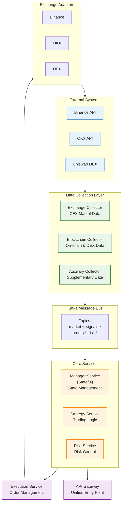

# Pixiu - Crypto Auto-Trading System

A professional-grade cryptocurrency quantitative trading system built with microservice architecture, supporting multiple exchanges and trading strategies.

## 🏗️ Architecture Overview

Pixiu follows a microservice architecture pattern with event-driven communication through Apache Kafka. Each service is independently deployable and can be developed using different programming languages.

### System Architecture



## 📁 Project Structure

```mermaid
graph TD
    A["pixiu/"] --> B["services/"]
    A --> C["deployment/"]
    A --> D["scripts/"]
    A --> E["docs/"]
    
    B --> F["data-collection/"]
    B --> G["adapters/"]
    B --> H["core/"]
    B --> I["infrastructure/"]
    
    F --> F1["exchange-collector/<br/>CEX market data - Python"]
    F --> F2["blockchain-collector/<br/>On-chain data - Go"]
    F --> F3["auxiliary-collector/<br/>Supplementary data - Python"]
    
    G --> G1["binance-adapter/<br/>Binance integration"]
    G --> G2["okx-adapter/<br/>OKX integration"]
    G --> G3["dex-adapter/<br/>DEX integration"]
    
    H --> H1["manager-service/<br/>State management - Python"]
    H --> H2["strategy-service/<br/>Strategy engine - Python"]
    H --> H3["risk-service/<br/>Risk control - Python"]
    H --> H4["execution-service/<br/>Order execution - Python/Rust"]
    
    I --> I1["api-gateway/<br/>API Gateway - Go"]
    I --> I2["config-service/<br/>Configuration management"]
    
    C --> C1["docker-compose/<br/>Docker Compose files"]
    C --> C2["kubernetes/<br/>K8s manifests"]
    C --> C3["helm/<br/>Helm charts"]
    
    E --> E1["api/<br/>API documentation"]
    E --> E2["architecture/<br/>Architecture docs"]
    E --> E3["deployment/<br/>Deployment guides"]
    
    %% Styling
    classDef folder fill:#e3f2fd,stroke:#1976d2,stroke-width:2px
    classDef service fill:#e8f5e8,stroke:#2e7d32,stroke-width:2px
    classDef config fill:#fff3e0,stroke:#f57c00,stroke-width:2px
    
    class A,B,C,D,E,F,G,H,I folder
    class F1,F2,F3,G1,G2,G3,H1,H2,H3,H4,I1,I2 service
    class C1,C2,C3,E1,E2,E3 config
```



## 🚀 Key Features

- **Multi-Exchange Support**: Integrated with major CEX (Binance, OKX) and DEX platforms
- **Strategy Framework**: Pluggable architecture for custom trading strategies
- **Risk Management**: Real-time risk monitoring and control
- **High Performance**: Optimized for low-latency trading
- **Scalability**: Horizontal scaling support for all stateless services
- **Observability**: Complete monitoring stack with Prometheus, Grafana, and ELK

## 🛠️ Technology Stack

### Core Technologies
- **Message Bus**: Apache Kafka
- **Databases**: PostgreSQL, TimescaleDB, Redis
- **Languages**: Python, Go, Rust (flexible per service)
- **Container**: Docker, Kubernetes

### Monitoring & Operations
- **Metrics**: Prometheus + Grafana
- **Logging**: ELK Stack (Elasticsearch, Logstash, Kibana)
- **Tracing**: Jaeger

## 🏃 Quick Start

### Prerequisites
- Docker and Docker Compose
- Git

### Development Setup

1. Clone the repository:
```bash
git clone https://github.com/yourusername/pixiu.git
cd pixiu
```

2. Copy environment configuration:
```bash
cp deployment/docker-compose/.env.example deployment/docker-compose/.env
```

3. Start the development environment:
```bash
cd deployment/docker-compose
docker-compose -f docker-compose.dev.yml up -d
```

4. Verify services are running:
```bash
docker-compose -f docker-compose.dev.yml ps
```

### Full Environment Setup

For the complete environment with monitoring:
```bash
cd deployment/docker-compose
docker-compose up -d
```

Access points:
- API Gateway: http://localhost:8000
- Kafka UI: http://localhost:8080
- Grafana: http://localhost:3000 (admin/admin123)
- Kibana: http://localhost:5601

## 📊 Core Services

### Manager Service (Stateful)
Central state management including API keys, balances, positions, and fund allocation.

### Strategy Service
Trading strategy execution engine with built-in technical indicators and backtesting.

### Risk Service
Real-time risk monitoring and control with configurable risk rules.

### Execution Service
High-performance order routing and execution management.

### Data Collection Services
- **Exchange Collector**: Real-time market data from exchanges
- **Blockchain Collector**: On-chain data and DEX monitoring
- **Auxiliary Collector**: Funding rates, sentiment, and other data

## 🔒 Security

- API key encryption at rest
- TLS for all communications
- Role-based access control (RBAC)
- Audit logging for all operations

## 📈 Performance

- Designed for low-frequency trading (minute to daily timeframes)
- Sub-second order execution latency
- Supports 50+ concurrent strategies
- Handles 1000+ market data updates per second

## 🤝 Contributing

Please read our contributing guidelines before submitting pull requests.

## 📄 License

This project is licensed under the MIT License - see the LICENSE file for details.

## ⚠️ Disclaimer

This software is for educational and research purposes only. Cryptocurrency trading involves substantial risk of loss. Always do your own research and trade responsibly.