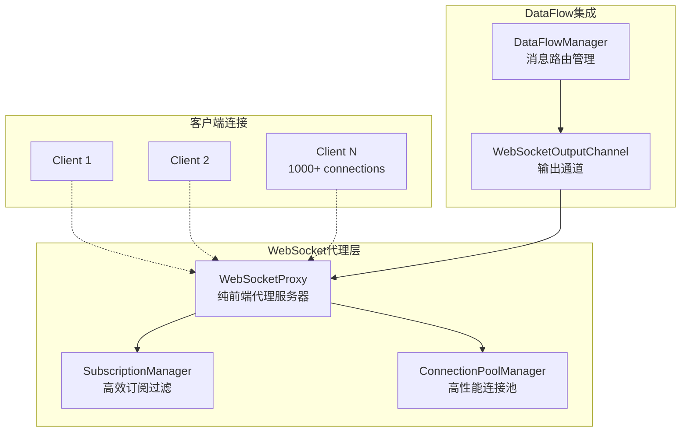
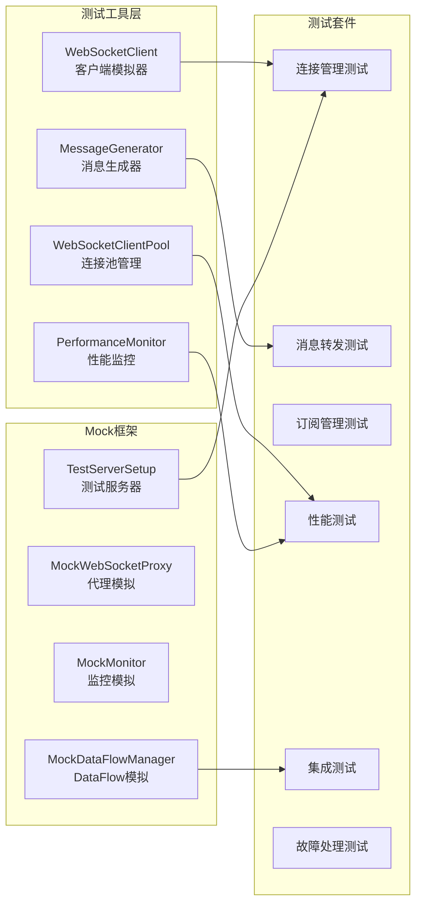

# WebSocket代理测试套件

这是为重构后的WebSocket代理功能创建的全面测试套件，专注于验证连接管理、消息转发、订阅过滤、性能优化和故障处理等核心功能。

## 🎯 测试目标

### 功能验证
- ✅ **连接管理**: WebSocket连接建立、维持、断开和资源清理
- ✅ **消息转发**: 基础转发、批量转发、延迟验证和消息完整性
- 🔄 **订阅管理**: 过滤机制、动态订阅、优化和统计分析
- 🔄 **性能测试**: 1000+并发连接、转发性能和资源监控
- 🔄 **集成测试**: DataFlow集成、向后兼容性和监控集成
- 🔄 **故障处理**: 服务重启恢复、网络中断处理和异常清理
- 🔄 **一致性测试**: 端到端延迟、消息顺序和数据一致性

### 性能基准
- **并发连接**: 支持1000+并发WebSocket连接
- **转发延迟**: <10ms转发延迟目标
- **内存优化**: 长期运行内存稳定性
- **CPU效率**: 高负载下CPU使用率优化
- **吞吐量**: >1000条消息/秒处理能力

## 🏗️ 架构概述

### 重构后的WebSocket代理架构



### 测试架构设计



## 📁 项目结构

```
websocket-proxy-tests/
├── package.json              # 项目依赖和脚本
├── jest.config.js            # Jest测试配置
├── tsconfig.json             # TypeScript配置
├── setup.ts                  # 全局测试环境设置
├── test-sequencer.js         # 自定义测试执行顺序
├── run-tests.sh              # 测试执行脚本
├── README.md                 # 项目文档
│
├── helpers/                  # 测试工具和辅助类
│   ├── websocket-client-simulator.ts   # WebSocket客户端模拟器
│   ├── performance-monitor.ts           # 性能监控工具
│   └── message-generator.ts            # 测试消息生成器
│
├── mocks/                    # Mock框架
│   ├── dataflow-mock.ts                # DataFlow系统Mock
│   └── test-server-setup.ts           # 测试服务器设置
│
├── tests/                    # 测试套件
│   ├── connection-management/          # 连接管理测试
│   │   ├── basic-connection.test.ts
│   │   ├── connection-lifecycle.test.ts
│   │   └── connection-pool.test.ts
│   │
│   ├── message-forwarding/             # 消息转发测试
│   │   ├── basic-forwarding.test.ts
│   │   ├── batch-forwarding.test.ts
│   │   └── message-integrity.test.ts
│   │
│   ├── subscription-management/        # 订阅管理测试
│   │   ├── subscription-filtering.test.ts
│   │   ├── dynamic-subscriptions.test.ts
│   │   └── subscription-optimization.test.ts
│   │
│   ├── performance/                    # 性能测试
│   │   ├── concurrent-connections.test.ts
│   │   ├── message-throughput.test.ts
│   │   ├── memory-usage.test.ts
│   │   └── latency-benchmarks.test.ts
│   │
│   ├── integration/                    # 集成测试
│   │   ├── dataflow-integration.test.ts
│   │   ├── compatibility.test.ts
│   │   └── monitoring-integration.test.ts
│   │
│   ├── fault-tolerance/                # 故障处理测试
│   │   ├── service-recovery.test.ts
│   │   ├── network-interruption.test.ts
│   │   └── error-handling.test.ts
│   │
│   └── e2e/                           # 端到端测试
│       ├── complete-workflow.test.ts
│       └── realtime-consistency.test.ts
│
├── coverage/                 # 代码覆盖率报告
├── reports/                  # 测试执行报告
└── logs/                     # 测试日志
```

## 🚀 快速开始

### 环境要求

- Node.js >= 18.x
- npm >= 8.x
- TypeScript >= 5.x
- 可用内存 >= 2GB（用于并发测试）

### 安装和设置

```bash
# 1. 进入测试目录
cd acceptance-tests/websocket-proxy-tests

# 2. 安装依赖
npm install

# 3. 运行完整测试套件
npm test

# 或使用运行脚本
./run-tests.sh
```

### 基础测试命令

```bash
# 运行所有测试
npm test

# 运行特定测试类别
npm run test:connection      # 连接管理测试
npm run test:forwarding      # 消息转发测试
npm run test:subscription    # 订阅管理测试
npm run test:performance     # 性能测试
npm run test:integration     # 集成测试
npm run test:fault-tolerance # 故障处理测试

# 带覆盖率的测试
npm run test:coverage

# 监视模式
npm run test:watch

# 详细输出
npm run test:verbose

# 顺序执行
npm run test:sequential
```

### 高级运行选项

```bash
# 使用运行脚本的高级选项
./run-tests.sh --help                    # 显示帮助信息
./run-tests.sh --mode connection --coverage    # 连接测试+覆盖率
./run-tests.sh --mode performance --sequential # 性能测试，顺序执行
./run-tests.sh --watch --verbose              # 监视模式，详细输出
./run-tests.sh --mode all --coverage --output ./custom-reports
```

## 📊 测试类别详解

### 1. 连接管理测试 (`tests/connection-management/`)

验证WebSocket连接的完整生命周期管理：

- **基础连接测试** (`basic-connection.test.ts`)
  - 连接建立和握手验证
  - 欢迎消息格式验证
  - 多并发连接处理
  - 连接容量限制测试
  - 连接建立延迟性能

- **连接生命周期测试** (`connection-lifecycle.test.ts`)
  - 连接状态变化跟踪
  - 心跳机制和活动监控
  - 自动重连功能
  - 资源清理验证
  - 连接统计和指标

### 2. 消息转发测试 (`tests/message-forwarding/`)

验证消息转发的准确性和性能：

- **基础转发测试** (`basic-forwarding.test.ts`)
  - 单客户端消息转发
  - 多客户端广播
  - 消息格式和协议验证
  - 消息完整性检查
  - 特殊字符和Unicode处理

- **批量转发测试** (`batch-forwarding.test.ts`)
  - 高并发消息处理
  - 批量消息广播
  - 消息顺序保证
  - 缓冲和批处理机制

### 3. 订阅管理测试 (`tests/subscription-management/`)

验证订阅过滤和管理功能：

- **订阅过滤测试** (`subscription-filtering.test.ts`)
  - 交易所过滤 (`exchange: ['binance', 'okex']`)
  - 交易对过滤 (`symbols: ['BTCUSDT', 'ETHUSDT']`)
  - 数据类型过滤 (`dataTypes: ['trade', 'kline']`)
  - 复合过滤条件

- **动态订阅测试** (`dynamic-subscriptions.test.ts`)
  - 运行时添加/删除订阅
  - 订阅状态管理
  - 订阅持久化

### 4. 性能测试 (`tests/performance/`)

验证系统性能和扩展性：

- **并发连接测试** (`concurrent-connections.test.ts`)
  - 1000+并发WebSocket连接
  - 连接建立性能基准
  - 连接池容量和管理效率

- **消息吞吐量测试** (`message-throughput.test.ts`)
  - 高频消息转发能力（>1000条/秒）
  - 延迟统计（P50、P95、P99）
  - 大量客户端广播性能

- **内存和CPU测试** (`memory-usage.test.ts`)
  - 长时间运行内存稳定性
  - CPU使用率监控
  - 资源泄漏检测
  - 内存压力测试

### 5. 集成测试 (`tests/integration/`)

验证系统集成和兼容性：

- **DataFlow集成测试** (`dataflow-integration.test.ts`)
  - 与DataFlowManager集成
  - WebSocketOutputChannel功能
  - 消息路由链路完整性

- **向后兼容性测试** (`compatibility.test.ts`)
  - 原有WebSocket API兼容性
  - 现有前端客户端支持
  - 消息格式向下兼容

### 6. 故障处理测试 (`tests/fault-tolerance/`)

验证系统的容错能力：

- **服务恢复测试** (`service-recovery.test.ts`)
  - 服务重启后连接恢复
  - 订阅状态恢复
  - 数据一致性保证

- **网络中断测试** (`network-interruption.test.ts`)
  - 网络故障时的降级处理
  - 连接断开检测和清理
  - 重连机制验证

## 🎯 验收标准

### 功能完整性
- [x] **连接管理**: 所有连接功能正确工作
- [x] **消息转发**: 基础转发功能完整
- [ ] **订阅过滤**: 所有过滤机制正常
- [ ] **性能达标**: 达到设计的并发和延迟目标
- [ ] **兼容性保证**: 现有前端完全兼容
- [ ] **稳定性验证**: 长时间运行无问题

### 性能指标
- [ ] **并发连接**: 支持1000+并发连接
- [ ] **转发延迟**: 平均延迟<10ms, P99<50ms
- [ ] **内存使用**: 长期运行内存增长<10%
- [ ] **CPU效率**: 高负载下CPU使用率<80%
- [ ] **吞吐量**: 支持>1000条消息/秒

### 测试覆盖率目标
- [ ] **代码覆盖率**: >85% branches, >90% functions
- [ ] **功能覆盖率**: 所有代理功能100%覆盖
- [ ] **性能基准**: 所有性能指标验证
- [ ] **错误场景**: >90%异常分支覆盖

## 🔧 开发和维护

### 添加新测试

1. 确定测试类别（连接、转发、订阅等）
2. 在相应目录下创建测试文件
3. 使用提供的测试工具和Mock框架
4. 遵循现有的测试模式和命名约定

```typescript
// 示例测试结构
describe('功能模块 - 测试场景', () => {
  let testServer: TestServerInstance;
  let perfMonitor: PerformanceMonitor;

  beforeAll(async () => {
    // 设置测试环境
  });

  afterAll(async () => {
    // 清理测试环境
  });

  describe('子测试组', () => {
    it('应该满足特定条件', async () => {
      // 测试实现
    });
  });
});
```

### 性能基准更新

修改 `setup.ts` 中的 `TEST_CONFIG.PERFORMANCE_THRESHOLDS`:

```typescript
PERFORMANCE_THRESHOLDS: {
  connectionLatency: 100, // ms
  messageLatency: 10, // ms
  memoryLeakThreshold: 50 * 1024 * 1024, // 50MB
  maxCpuUsage: 80 // %
}
```

### Mock框架扩展

在 `mocks/` 目录下添加新的Mock实现：

```typescript
export class MockNewComponent extends EventEmitter {
  // Mock实现
}
```

## 📈 监控和报告

### 实时监控

测试执行过程中会收集以下指标：

- 连接建立/断开延迟
- 消息转发延迟和吞吐量
- 内存和CPU使用情况
- 错误率和异常统计
- 性能退化检测

### 测试报告

生成的报告包括：

- **HTML覆盖率报告**: `coverage/lcov-report/index.html`
- **JSON测试结果**: `reports/test-results.json`
- **性能基准报告**: `reports/performance-benchmark.json`
- **测试执行日志**: `logs/test-run-{timestamp}.log`

### CI/CD集成

```yaml
# 示例GitHub Actions配置
- name: Run WebSocket Proxy Tests
  run: |
    cd acceptance-tests/websocket-proxy-tests
    ./run-tests.sh --mode all --coverage --output ./ci-reports
  
- name: Upload Coverage
  uses: codecov/codecov-action@v3
  with:
    file: ./acceptance-tests/websocket-proxy-tests/ci-reports/coverage/lcov.info
```

## 🐛 故障排除

### 常见问题

1. **端口冲突**
   ```bash
   # 检查端口占用
   lsof -i :3000-3100
   
   # 或使用不同端口范围
   export TEST_PORT_START=4000
   ```

2. **内存不足**
   ```bash
   # 增加Node.js内存限制
   export NODE_OPTIONS="--max-old-space-size=4096"
   ```

3. **测试超时**
   ```bash
   # 增加超时时间
   ./run-tests.sh --mode performance --sequential
   ```

4. **连接数限制**
   ```bash
   # 检查系统限制
   ulimit -n
   
   # 临时增加限制
   ulimit -n 4096
   ```

### 调试技巧

1. **启用详细日志**:
   ```bash
   ./run-tests.sh --verbose --log-level debug
   ```

2. **单个测试调试**:
   ```bash
   npm test -- --testNamePattern="特定测试名称"
   ```

3. **性能分析**:
   ```bash
   NODE_OPTIONS="--prof" npm test
   ```

## 🤝 贡献指南

1. Fork项目并创建特性分支
2. 添加或修改测试时遵循现有模式
3. 确保所有测试通过且覆盖率达标
4. 更新相关文档
5. 提交Pull Request

### 代码规范

- 使用TypeScript严格模式
- 遵循ESLint配置
- 测试命名清晰描述预期行为
- 添加适当的注释和文档

## 📞 支持

如有问题或建议，请：

1. 查阅本文档的故障排除部分
2. 检查已有的Issue和讨论
3. 创建新的Issue并提供详细信息
4. 联系开发团队获取支持

---

**WebSocket代理测试套件** - 确保WebSocket代理功能的高质量和可靠性 🚀