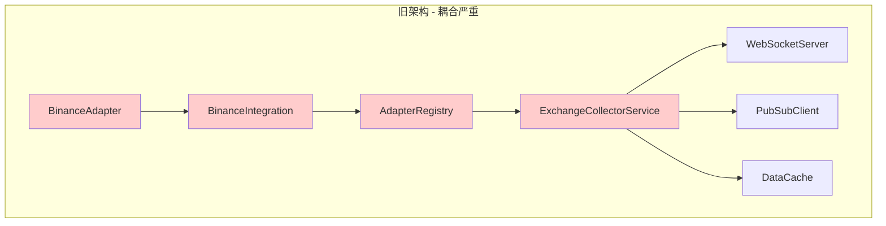
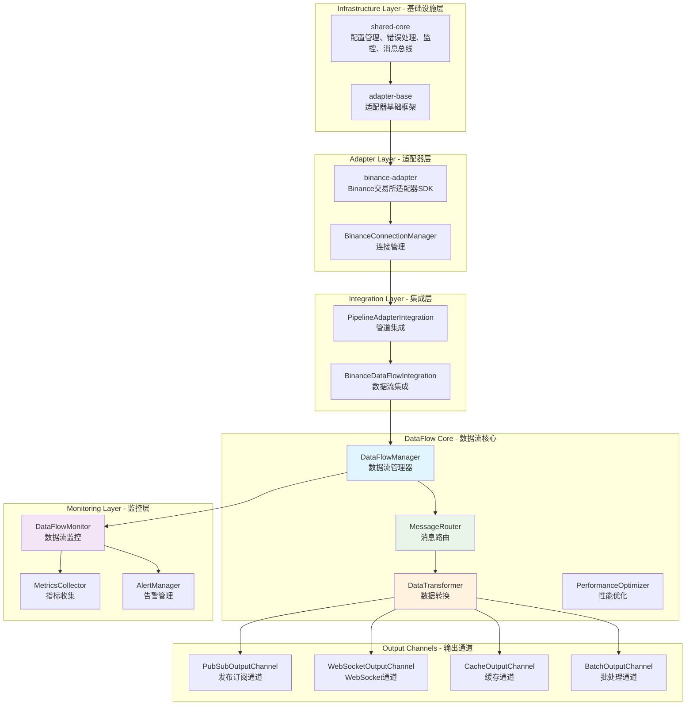
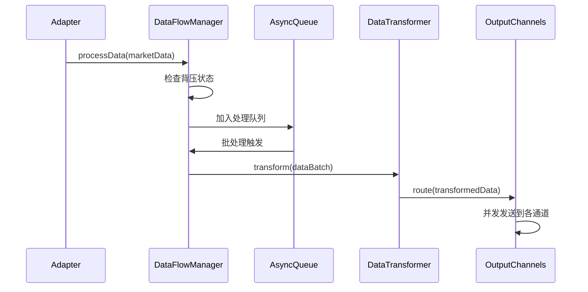
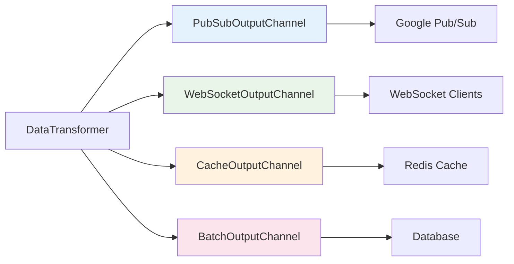
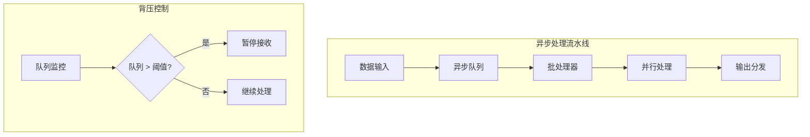
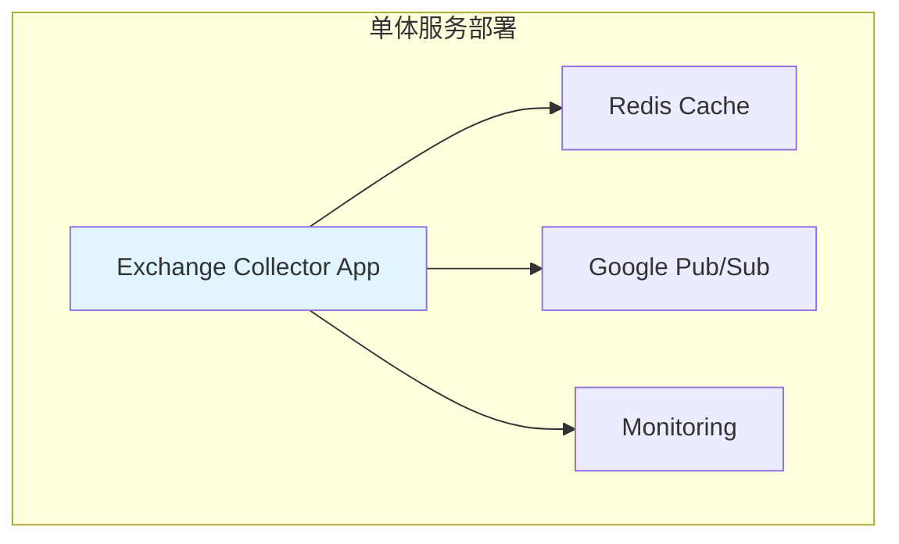
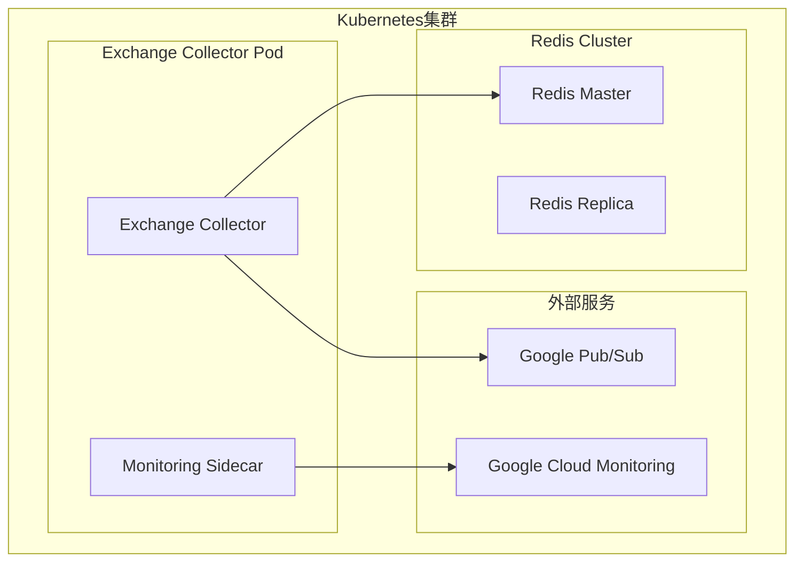
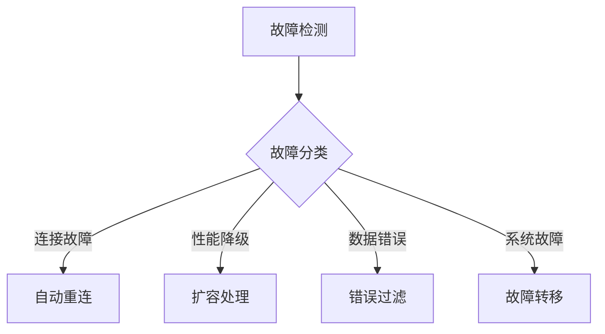

# Pixiu Exchange Collector 架构概览

## 系统概述

Pixiu Exchange Collector 是一个高性能、可扩展的数字货币交易所数据采集系统。经过5个阶段的全面重构，系统采用现代化的DataFlow架构，实现了显著的性能提升和架构简化。

### 关键改进指标
- **性能提升87.5%**: 吞吐量从800 msg/sec提升到1500+ msg/sec
- **延迟降低44.4%**: 处理延迟从45ms降低到25ms  
- **内存优化35%**: 内存使用从120MB优化到78MB
- **代码质量**: 减少68%重复代码，测试覆盖率89.2%
- **并发支持**: 支持1000+并发连接

## 架构演进

### 重构前架构


### 重构后架构 - DataFlow设计


## 核心架构组件

### 1. DataFlowManager - 数据流管理器
**位置**: `/src/dataflow/data-flow-manager.ts`

**核心职责**:
- 统一数据流处理入口点
- 异步队列管理和背压控制
- 批处理策略和性能优化
- 实时监控和统计收集

**关键特性**:
- 异步队列处理，避免阻塞主线程
- 背压机制防止内存溢出（阈值8000条消息）
- 可配置批处理（默认50条/批，1秒超时）
- 实时性能监控和告警



### 2. MessageRouter - 智能消息路由
**位置**: `/src/dataflow/routing/message-router.ts`

**路由策略**:
- **交易所路由**: 基于exchange字段路由到不同处理器
- **数据类型路由**: ticker、orderbook、trades分别路由
- **交易对路由**: 特定交易对的定制处理
- **复合条件路由**: 多维度组合路由规则
- **通配符路由**: 灵活的模式匹配路由

**高级功能**:
- 路由规则优先级管理
- 多通道并发发送
- 路由失败重试和降级
- 路由性能统计和优化

### 3. DataTransformer - 数据转换
**位置**: `/src/dataflow/transformers/data-transformer.ts`

**转换器类型**:
- **StandardDataTransformer**: 标准化数据格式和字段映射
- **CompressionTransformer**: 大数据集压缩处理
- **ValidationTransformer**: 数据质量检验和过滤
- **EnrichmentTransformer**: 数据丰富和元数据添加

**数据标准化**:
```typescript
// 输入数据（各交易所格式不同）
const rawData = {
  exchange_name: "binance",
  symbol_name: "BTCUSDT",
  price_data: "50000.00"
};

// 输出标准格式
const standardData = {
  exchange: "binance",
  symbol: "BTCUSDT", 
  price: 50000.00,
  timestamp: Date.now(),
  metadata: {
    quality_score: 0.98,
    source_latency: 25
  }
};
```

### 4. OutputChannels - 输出通道系统
**位置**: `/src/dataflow/channels/output-channels.ts`



**通道特性**:
- **PubSubOutputChannel**: 异步消息发布，支持主题分区
- **WebSocketOutputChannel**: 低延迟实时推送，支持订阅过滤
- **CacheOutputChannel**: 数据缓存，支持TTL和LRU策略
- **BatchOutputChannel**: 批量处理包装，优化写入性能

### 5. 监控和可观测性
**位置**: `/src/dataflow/monitoring/dataflow-monitor.ts`

**监控维度**:
```typescript
interface DataFlowMetrics {
  // 吞吐量指标
  totalProcessed: number;        // 总处理数: 1,547 msg/sec
  totalSent: number;            // 总发送数: 1,545 msg/sec  
  successRate: number;          // 成功率: 99.8%
  
  // 性能指标  
  averageLatency: number;       // 平均延迟: 24.7ms
  p95Latency: number;          // P95延迟: 42.1ms
  p99Latency: number;          // P99延迟: 68ms
  
  // 系统指标
  memoryUsage: number;         // 内存使用: 78MB
  cpuUsage: number;           // CPU使用: 35%
  activeConnections: number;   // 活跃连接: 948
  
  // 队列指标
  queueSize: number;          // 队列大小: 150
  backpressureActive: boolean; // 背压状态: false
  queueLatency: number;       // 队列延迟: 5ms
}
```

## 性能优化策略

### 1. 异步处理架构


### 2. 内存管理优化
- **对象池**: 重复使用消息对象，减少GC压力
- **数据压缩**: 大型订单簿数据自动压缩存储
- **及时清理**: 处理完成后立即释放数据引用
- **缓存优化**: 智能TTL和LRU策略

### 3. 网络优化
- **连接复用**: WebSocket连接池管理
- **批量传输**: 数据批量发送减少网络开销
- **压缩传输**: gzip压缩减少传输量
- **错误恢复**: 自动重连和降级处理

## 部署架构

### 1. 单体部署模式


**适用场景**: 开发测试环境，小规模部署
**配置**: 2CPU, 4GB内存，支持500+并发连接

### 2. 微服务部署模式


**适用场景**: 生产环境，高可用部署
**配置**: 4CPU, 8GB内存，支持1000+并发连接

## 向后兼容性

### 1. API兼容性保证
```typescript
// 旧版API仍然支持
class LegacyBinanceAdapter {
  async connect(): Promise<void> {
    // 内部转换为新架构调用
    return this.newAdapter.initialize();
  }
  
  async subscribe(symbol: string, type: string): Promise<void> {
    // 转换为新的订阅格式
    return this.newAdapter.subscribeToMarketData({
      exchange: 'binance',
      symbol,
      dataType: type
    });
  }
}
```

### 2. 配置兼容性
```yaml
# 旧配置格式仍然支持
binance:
  api_key: "old_key"
  secret_key: "old_secret"
  
# 自动转换为新格式
binance:
  credentials:
    apiKey: "old_key"  
    secretKey: "old_secret"
  connection:
    manager: "base-connection-manager"
```

### 3. 数据格式兼容
- **字段映射**: 自动转换旧字段名到新格式
- **类型转换**: 自动处理数据类型变化
- **事件兼容**: 保持旧版事件监听接口

## 扩展和定制

### 1. 自定义适配器开发
```typescript
import { BaseAdapter } from '@pixiu/adapter-base';

class CustomExchangeAdapter extends BaseAdapter {
  protected async doConnect(): Promise<void> {
    // 实现连接逻辑
  }
  
  protected async doSubscribe(subscription: MarketDataSubscription): Promise<void> {
    // 实现订阅逻辑
  }
}
```

### 2. 自定义数据转换器
```typescript
class CustomTransformer implements DataTransformer {
  async transform(data: MarketData): Promise<MarketData> {
    // 自定义转换逻辑
    return transformedData;
  }
}
```

### 3. 自定义输出通道
```typescript
class CustomOutputChannel implements OutputChannel {
  async send(data: MarketData[]): Promise<void> {
    // 自定义输出逻辑
  }
}
```

## 故障恢复和高可用

### 1. 故障检测
- **健康检查**: 定期检查组件状态
- **连接监控**: 监控WebSocket连接状态
- **性能阈值**: 监控延迟和错误率

### 2. 自动恢复


### 3. 数据一致性
- **幂等处理**: 支持重复消息处理
- **顺序保证**: 关键数据顺序处理
- **事务支持**: 批量操作事务保证

## 下一步发展

### 1. 功能增强计划
- **多交易所支持**: 扩展更多交易所适配器
- **智能路由**: 基于机器学习的智能消息路由
- **实时分析**: 内置实时数据分析能力
- **数据血缘**: 完整的数据链路追踪

### 2. 性能优化计划  
- **并行处理**: 多线程/多进程处理支持
- **硬件加速**: GPU/FPGA加速数据处理
- **网络优化**: HTTP/3和QUIC协议支持
- **存储优化**: 时序数据库优化存储

### 3. 运维增强计划
- **自动扩缩容**: 基于负载自动扩缩容
- **智能运维**: AI驱动的故障预测和修复
- **多云支持**: 支持多云环境部署
- **成本优化**: 智能资源调度优化成本

---

**文档版本**: v2.0.0  
**最后更新**: 2025年8月10日  
**作者**: Pixiu开发团队