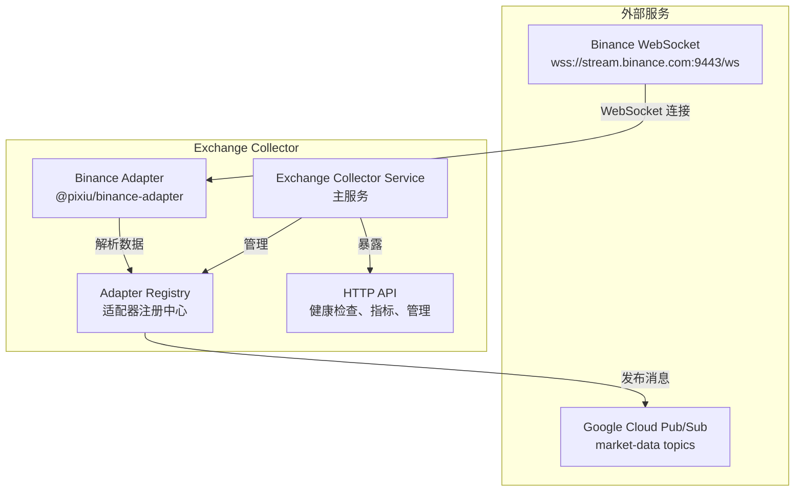

# Binance Exchange Collector 服务启动文档

## 概述

本文档详细说明如何启动 Binance Exchange Collector 服务，包括连接到真实的 Binance WebSocket 和 Google Cloud 资源的完整配置。

## 架构说明

Exchange Collector 服务使用以下技术栈：
- **TypeScript/Node.js** - 基于 npm workspace 的微服务架构
- **Binance WebSocket** - 实时市场数据订阅
- **Google Cloud Pub/Sub** - 消息队列和事件分发
- **Express.js** - HTTP API 服务器
- **Prometheus** - 指标监控



## 前置条件

### 1. 环境要求
- Node.js 18+ 
- TypeScript 5.3+
- Google Cloud SDK (可选，用于生产环境)

### 2. 项目依赖
确保所有 workspace 依赖已安装：
```bash
npm install
```

### 3. Google Cloud 配置

#### 开发环境（使用模拟器）
```bash
# 启动 Pub/Sub 模拟器
cd deployment/docker-compose
docker-compose -f docker-compose.dev.yml up -d pubsub-emulator
```

#### 生产环境（真实 Google Cloud）
```bash
# 设置项目 ID
export GOOGLE_CLOUD_PROJECT=pixiu-trading-dev

# 认证（如果需要）
gcloud auth application-default login

# 或使用服务账号
export GOOGLE_APPLICATION_CREDENTIALS=/path/to/service-account-key.json
```

## 配置说明

### 1. 环境变量配置

创建或编辑 `.env.gcloud` 文件：
```bash
# Google Cloud 配置
GOOGLE_CLOUD_PROJECT=pixiu-trading-dev
GOOGLE_APPLICATION_CREDENTIALS=/home/codespace/.config/gcloud/pixiu-trading-key.json

# 生产环境请留空，开发环境设置为模拟器地址
PUBSUB_EMULATOR_HOST=localhost:8085

# 服务配置
NODE_ENV=development
LOG_LEVEL=info
PORT=8080

# Binance 订阅配置（可选，会覆盖配置文件）
BINANCE_SYMBOLS=BTCUSDT,ETHUSDT,ADAUSDT
```

### 2. 服务配置文件

编辑 `services/data-collection/exchange-collector/config/development.yaml`：

```yaml
# 服务基本配置
name: exchange-collector
version: 1.0.0
environment: development

server:
  port: 8080
  host: 0.0.0.0
  enableCors: true

# Binance 适配器配置
adapters:
  binance:
    config:
      enabled: true
      endpoints:
        # 真实 Binance WebSocket 端点
        ws: wss://stream.binance.com:9443/ws
        rest: https://api.binance.com/api
      connection:
        timeout: 10000
        maxRetries: 3
        retryInterval: 5000
        heartbeatInterval: 30000
    subscription:
      symbols:
        - BTCUSDT
        - ETHUSDT
        - ADAUSDT
      dataTypes:
        - trade      # 实时交易数据
        - ticker     # 24小时统计数据
        - kline_1m   # 1分钟K线数据
      enableAllTickers: false
    extensions:
      testnet: false              # 使用真实网络
      enableCompression: true
      enableCombinedStream: true
      maxStreamCount: 1024

# Google Cloud Pub/Sub 配置
pubsub:
  projectId: pixiu-trading-dev
  # 开发环境使用模拟器，生产环境设为 false
  useEmulator: true
  emulatorHost: localhost:8085
  topicPrefix: market-data
  publishSettings:
    enableBatching: true
    batchSize: 100
    batchTimeout: 1000
    enableMessageOrdering: false
    retrySettings:
      maxRetries: 3
      initialRetryDelay: 1000
      maxRetryDelay: 60000

# 监控配置
monitoring:
  enableMetrics: true
  enableHealthCheck: true
  metricsInterval: 30000
  healthCheckInterval: 30000
  prometheus:
    enabled: true
    port: 9090
    path: /metrics

# 日志配置
logging:
  level: info
  format: json
  output: console
```

## 启动流程

### 1. 开发环境启动

#### 步骤一：启动基础设施服务
```bash
# 启动开发环境（数据库 + Pub/Sub 模拟器）
cd deployment/docker-compose
docker-compose -f docker-compose.dev.yml up -d

# 验证服务状态
docker-compose -f docker-compose.dev.yml ps
```

#### 步骤二：构建项目
```bash
# 构建所有 TypeScript 包
npm run build

# 或只构建 Exchange Collector 相关包
npm run build:infrastructure
npm run build:adapters
npm run build -w @pixiu/exchange-collector
```

#### 步骤三：启动服务
```bash
# 进入服务目录
cd services/data-collection/exchange-collector

# 使用开发模式启动（支持热重载）
npm run dev

# 或直接运行编译后的代码
npm start
```

### 2. 生产环境启动

#### 步骤一：设置环境变量
```bash
# 加载 Google Cloud 配置
source .env.gcloud

# 设置生产环境
export NODE_ENV=production
export PUBSUB_EMULATOR_HOST=
```

#### 步骤二：构建生产版本
```bash
npm run build
```

#### 步骤三：启动服务
```bash
cd services/data-collection/exchange-collector
npm start
```

### 3. Docker 方式启动

#### 构建镜像
```bash
cd services/data-collection/exchange-collector
docker build -t pixiu/exchange-collector:latest .
```

#### 运行容器
```bash
docker run -d \
  --name exchange-collector \
  -p 8080:8080 \
  -p 9090:9090 \
  -e GOOGLE_CLOUD_PROJECT=pixiu-trading-dev \
  -e PUBSUB_EMULATOR_HOST=localhost:8085 \
  -e LOG_LEVEL=info \
  pixiu/exchange-collector:latest
```

## 验证服务运行

### 1. 健康检查
```bash
# 服务健康状态
curl http://localhost:8080/health

# 适配器状态
curl http://localhost:8080/api/adapters/status
```

### 2. 监控指标
```bash
# Prometheus 指标
curl http://localhost:9090/metrics

# 获取 Binance 适配器状态
curl http://localhost:8080/api/adapters/binance/status
```

### 3. 日志监控
```bash
# 查看服务日志
docker logs exchange-collector -f

# 开发环境日志
npm run dev
```

## 数据流验证

### 1. WebSocket 连接验证
服务启动后，检查以下日志信息：
```
[info] Binance WebSocket connected to: wss://stream.binance.com:9443/stream?streams=btcusdt@trade/ethusdt@trade/btcusdt@ticker
[info] Binance subscriptions started: symbols=[BTCUSDT,ETHUSDT], dataTypes=[trade,ticker]
```

### 2. Pub/Sub 消息验证
检查数据是否成功发布到 Google Cloud Pub/Sub：
```bash
# 使用 gcloud 订阅主题查看消息
gcloud pubsub subscriptions create test-sub --topic=market-data-binance-trade
gcloud pubsub subscriptions pull test-sub --limit=5
```

### 3. 实时数据样例
成功启动后，服务会接收并处理类似以下格式的市场数据：

**交易数据 (Trade):**
```json
{
  "exchange": "binance",
  "symbol": "BTC/USDT",
  "type": "trade",
  "timestamp": 1693920000000,
  "data": {
    "id": "12345",
    "price": 26500.00,
    "quantity": 0.001,
    "side": "buy"
  },
  "receivedAt": 1693920000050
}
```

**24小时统计数据 (Ticker):**
```json
{
  "exchange": "binance",
  "symbol": "BTC/USDT", 
  "type": "ticker",
  "timestamp": 1693920000000,
  "data": {
    "lastPrice": 26500.00,
    "bidPrice": 26499.99,
    "askPrice": 26500.01,
    "change24h": 1.25,
    "volume24h": 12345.67
  }
}
```

## 故障排除

### 1. 常见问题

#### WebSocket 连接失败
- 检查网络连接和防火墙设置
- 验证 Binance WebSocket 端点是否可访问
- 检查订阅配置是否正确

#### Google Cloud 认证失败
```bash
# 检查认证状态
gcloud auth list

# 重新认证
gcloud auth application-default login
```

#### Pub/Sub 连接问题
```bash
# 验证项目 ID
echo $GOOGLE_CLOUD_PROJECT

# 检查 Pub/Sub 模拟器状态
curl http://localhost:8085
```

### 2. 调试模式

#### 启用详细日志
```bash
export LOG_LEVEL=debug
npm run dev
```

#### 使用调试器
```bash
# Node.js 调试模式
node --inspect dist/index.js

# 或使用 ts-node
npx ts-node --inspect src/index.ts
```

### 3. 性能监控

#### 内存和 CPU 使用
```bash
# 使用 htop 监控资源使用
htop

# 或使用 Node.js 内置分析
node --prof dist/index.js
```

#### WebSocket 连接监控
- 监控消息接收速率
- 检查重连次数和频率
- 验证数据解析错误率

## 安全注意事项

1. **生产环境配置**
   - 使用服务账号密钥而非个人认证
   - 限制 Pub/Sub 主题的访问权限
   - 启用 TLS 和认证

2. **网络安全**
   - 配置适当的防火墙规则
   - 使用 VPC 内网通信
   - 启用监控和告警

3. **密钥管理**
   - 不要在代码中硬编码密钥
   - 使用 Google Secret Manager
   - 定期轮换访问密钥

## 扩展配置

### 多交易对配置
```yaml
adapters:
  binance:
    subscription:
      symbols:
        - BTCUSDT
        - ETHUSDT
        - ADAUSDT
        - DOTUSDT
        - LINKUSDT
      dataTypes:
        - trade
        - ticker
        - kline_1m
        - kline_5m
```

### 性能优化配置
```yaml
pubsub:
  publishSettings:
    enableBatching: true
    batchSize: 500
    batchTimeout: 500
    enableMessageOrdering: true

monitoring:
  metricsInterval: 10000
  enableMetrics: true
```

通过以上配置和启动流程，Binance Exchange Collector 服务将成功连接到真实的 Binance WebSocket 和 Google Cloud Pub/Sub，提供稳定的实时市场数据采集服务。