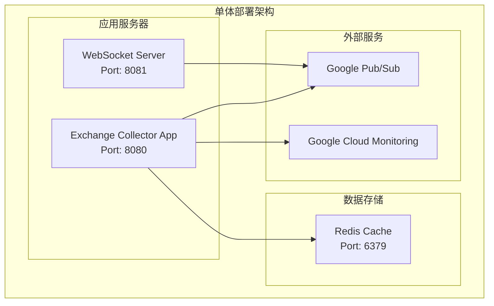
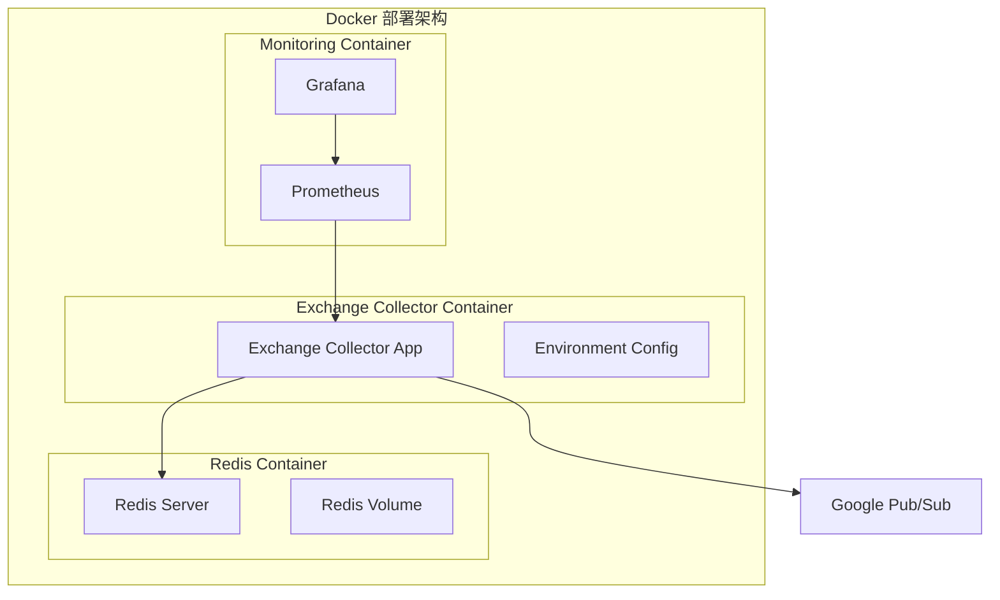
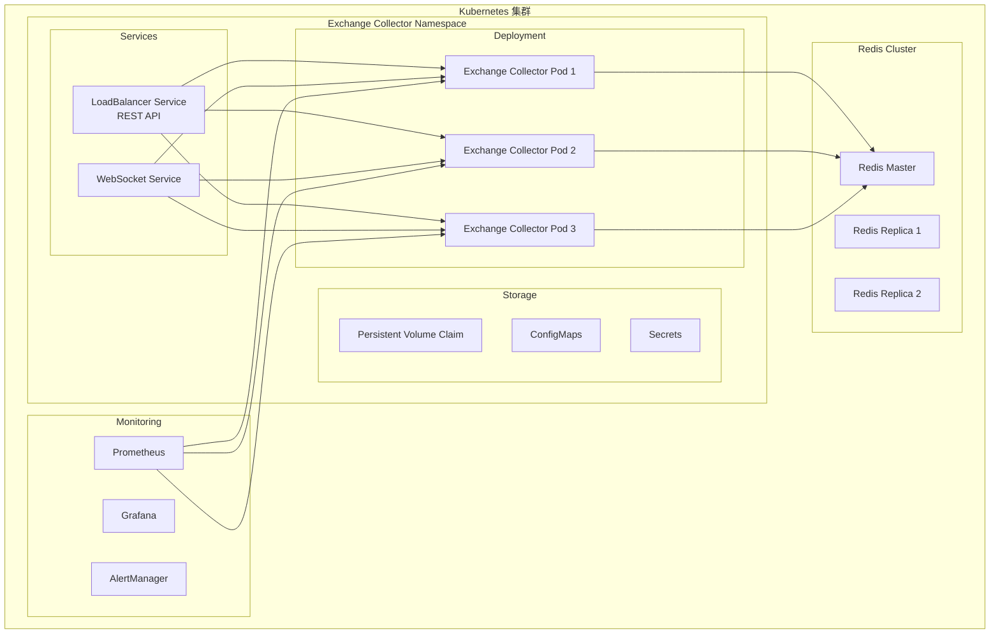

# Exchange Collector 部署指南

## 部署概述

Exchange Collector v2.0支持多种部署模式，从开发环境到生产环境的高可用部署。本指南涵盖所有部署场景和最佳实践。

### 系统要求

#### 最低配置
- **CPU**: 2核心
- **内存**: 4GB RAM
- **存储**: 20GB SSD
- **网络**: 100Mbps带宽
- **Node.js**: >= 18.0.0
- **操作系统**: Linux (Ubuntu 20.04+)、macOS、Windows

#### 推荐生产配置
- **CPU**: 4核心以上
- **内存**: 8GB RAM以上
- **存储**: 100GB SSD
- **网络**: 1Gbps带宽
- **负载均衡**: 支持WebSocket的负载均衡器

## 部署架构模式

### 1. 单体部署 - 开发/测试环境



**适用场景**: 
- 开发和测试环境
- 小规模数据采集 (<500 symbols)
- 单机部署验证

### 2. 容器化部署 - Docker



**适用场景**:
- 开发环境标准化
- CI/CD集成部署
- 容器编排平台

### 3. Kubernetes部署 - 生产环境



**适用场景**:
- 生产环境高可用部署
- 大规模数据采集 (>1000 symbols)
- 自动扩缩容需求

## 环境配置

### 1. 开发环境部署

#### 环境变量配置
```bash
# .env.development
NODE_ENV=development
LOG_LEVEL=debug

# 应用配置
PORT=8080
WEBSOCKET_PORT=8081

# Redis配置
REDIS_URL=redis://localhost:6379
REDIS_PASSWORD=

# Google Cloud配置
GOOGLE_CLOUD_PROJECT=your-project-id
PUBSUB_EMULATOR_HOST=localhost:8085

# 适配器配置
BINANCE_API_KEY=your-api-key
BINANCE_SECRET_KEY=your-secret-key
BINANCE_TESTNET=true

# 数据流配置
DATAFLOW_ENABLED=true
DATAFLOW_BATCH_SIZE=50
DATAFLOW_FLUSH_TIMEOUT=1000

# 性能配置
MAX_QUEUE_SIZE=10000
BACKPRESSURE_THRESHOLD=8000
ENABLE_COMPRESSION=true
```

#### 快速启动脚本
```bash
#!/bin/bash
# scripts/dev-start.sh

echo "启动开发环境..."

# 启动Redis
redis-server --daemonize yes --port 6379

# 启动Pub/Sub模拟器
gcloud beta emulators pubsub start --host-port=localhost:8085 &

# 等待服务启动
sleep 3

# 安装依赖
npm install

# 启动应用
npm run dev
```

### 2. 生产环境配置

#### 环境变量配置
```bash
# .env.production
NODE_ENV=production
LOG_LEVEL=info

# 应用配置
PORT=8080
WEBSOCKET_PORT=8081
CLUSTER_MODE=true
WORKERS=4

# Redis集群配置
REDIS_CLUSTER_ENDPOINTS=redis-1:6379,redis-2:6379,redis-3:6379
REDIS_PASSWORD=your-secure-password
REDIS_TLS=true

# Google Cloud配置
GOOGLE_CLOUD_PROJECT=your-prod-project
GOOGLE_APPLICATION_CREDENTIALS=/path/to/service-account.json

# 安全配置
API_RATE_LIMIT=1000
WEBSOCKET_RATE_LIMIT=100
CORS_ORIGINS=https://yourdomain.com

# 监控配置
ENABLE_METRICS=true
METRICS_PORT=9090
HEALTH_CHECK_INTERVAL=30000

# 性能优化
ENABLE_CLUSTERING=true
MAX_MEMORY_USAGE=6144
GC_OPTIMIZATION=true
```

### 3. Docker部署配置

#### Dockerfile
```dockerfile
# Dockerfile
FROM node:18-alpine

WORKDIR /app

# 安装系统依赖
RUN apk add --no-cache python3 make g++

# 复制package文件
COPY package*.json ./

# 安装依赖
RUN npm ci --only=production

# 复制源码
COPY src/ ./src/
COPY tsconfig.json ./

# 构建应用
RUN npm run build

# 创建非root用户
RUN addgroup -g 1001 -S nodejs && \
    adduser -S nodejs -u 1001

# 切换到非root用户
USER nodejs

# 暴露端口
EXPOSE 8080 8081 9090

# 健康检查
HEALTHCHECK --interval=30s --timeout=10s --start-period=5s --retries=3 \
  CMD curl -f http://localhost:8080/health || exit 1

# 启动命令
CMD ["npm", "start"]
```

#### Docker Compose配置
```yaml
# docker-compose.yml
version: '3.8'

services:
  exchange-collector:
    build: .
    image: pixiu/exchange-collector:2.0.0
    ports:
      - "8080:8080"
      - "8081:8081"
      - "9090:9090"
    environment:
      - NODE_ENV=production
      - REDIS_URL=redis://redis:6379
      - GOOGLE_CLOUD_PROJECT=${GOOGLE_CLOUD_PROJECT}
    volumes:
      - ./config:/app/config
      - ./logs:/app/logs
      - gcp-service-account:/app/credentials:ro
    depends_on:
      - redis
      - pubsub-emulator
    restart: unless-stopped
    deploy:
      resources:
        limits:
          memory: 4G
          cpus: '2'
        reservations:
          memory: 2G
          cpus: '1'

  redis:
    image: redis:7-alpine
    ports:
      - "6379:6379"
    volumes:
      - redis_data:/data
      - ./redis.conf:/usr/local/etc/redis/redis.conf
    command: redis-server /usr/local/etc/redis/redis.conf
    restart: unless-stopped

  pubsub-emulator:
    image: google/cloud-sdk:alpine
    ports:
      - "8085:8085"
    command: |
      sh -c "
        gcloud beta emulators pubsub start \
          --host-port=0.0.0.0:8085 \
          --data-dir=/data
      "
    volumes:
      - pubsub_data:/data

  prometheus:
    image: prom/prometheus:latest
    ports:
      - "9091:9090"
    volumes:
      - ./prometheus.yml:/etc/prometheus/prometheus.yml
      - prometheus_data:/prometheus
    command:
      - '--config.file=/etc/prometheus/prometheus.yml'
      - '--storage.tsdb.path=/prometheus'

  grafana:
    image: grafana/grafana:latest
    ports:
      - "3000:3000"
    volumes:
      - grafana_data:/var/lib/grafana
      - ./grafana/dashboards:/etc/grafana/provisioning/dashboards
    environment:
      - GF_SECURITY_ADMIN_PASSWORD=admin123

volumes:
  redis_data:
  pubsub_data:
  prometheus_data:
  grafana_data:
  gcp-service-account:
    external: true
```

### 4. Kubernetes部署配置

#### 部署清单
```yaml
# k8s/deployment.yaml
apiVersion: apps/v1
kind: Deployment
metadata:
  name: exchange-collector
  namespace: trading-system
  labels:
    app: exchange-collector
    version: "2.0.0"
spec:
  replicas: 3
  strategy:
    type: RollingUpdate
    rollingUpdate:
      maxUnavailable: 1
      maxSurge: 1
  selector:
    matchLabels:
      app: exchange-collector
  template:
    metadata:
      labels:
        app: exchange-collector
        version: "2.0.0"
      annotations:
        prometheus.io/scrape: "true"
        prometheus.io/port: "9090"
        prometheus.io/path: "/metrics"
    spec:
      serviceAccountName: exchange-collector
      containers:
      - name: exchange-collector
        image: pixiu/exchange-collector:2.0.0
        ports:
        - containerPort: 8080
          name: http
          protocol: TCP
        - containerPort: 8081
          name: websocket
          protocol: TCP
        - containerPort: 9090
          name: metrics
          protocol: TCP
        env:
        - name: NODE_ENV
          value: "production"
        - name: REDIS_URL
          valueFrom:
            secretKeyRef:
              name: redis-config
              key: url
        - name: GOOGLE_CLOUD_PROJECT
          valueFrom:
            configMapKeyRef:
              name: app-config
              key: gcp-project
        resources:
          requests:
            memory: "2Gi"
            cpu: "1000m"
          limits:
            memory: "4Gi"
            cpu: "2000m"
        livenessProbe:
          httpGet:
            path: /health
            port: 8080
          initialDelaySeconds: 30
          periodSeconds: 10
          timeoutSeconds: 5
          failureThreshold: 3
        readinessProbe:
          httpGet:
            path: /health
            port: 8080
          initialDelaySeconds: 5
          periodSeconds: 5
          timeoutSeconds: 3
          failureThreshold: 2
        volumeMounts:
        - name: config-volume
          mountPath: /app/config
          readOnly: true
        - name: gcp-service-account
          mountPath: /app/credentials
          readOnly: true
      volumes:
      - name: config-volume
        configMap:
          name: exchange-collector-config
      - name: gcp-service-account
        secret:
          secretName: gcp-service-account
      affinity:
        podAntiAffinity:
          preferredDuringSchedulingIgnoredDuringExecution:
          - weight: 100
            podAffinityTerm:
              labelSelector:
                matchLabels:
                  app: exchange-collector
              topologyKey: kubernetes.io/hostname
```

#### 服务配置
```yaml
# k8s/service.yaml
apiVersion: v1
kind: Service
metadata:
  name: exchange-collector-http
  namespace: trading-system
  labels:
    app: exchange-collector
spec:
  type: ClusterIP
  ports:
  - port: 80
    targetPort: 8080
    protocol: TCP
    name: http
  selector:
    app: exchange-collector

---
apiVersion: v1  
kind: Service
metadata:
  name: exchange-collector-websocket
  namespace: trading-system
  labels:
    app: exchange-collector
spec:
  type: LoadBalancer
  ports:
  - port: 8081
    targetPort: 8081
    protocol: TCP
    name: websocket
  selector:
    app: exchange-collector
  sessionAffinity: ClientIP
```

#### Ingress配置
```yaml
# k8s/ingress.yaml
apiVersion: networking.k8s.io/v1
kind: Ingress
metadata:
  name: exchange-collector-ingress
  namespace: trading-system
  annotations:
    kubernetes.io/ingress.class: nginx
    nginx.ingress.kubernetes.io/websocket-services: exchange-collector-websocket
    nginx.ingress.kubernetes.io/proxy-read-timeout: "3600"
    nginx.ingress.kubernetes.io/proxy-send-timeout: "3600"
spec:
  tls:
  - hosts:
    - api.yourdomain.com
    - ws.yourdomain.com
    secretName: tls-secret
  rules:
  - host: api.yourdomain.com
    http:
      paths:
      - path: /
        pathType: Prefix
        backend:
          service:
            name: exchange-collector-http
            port:
              number: 80
  - host: ws.yourdomain.com
    http:
      paths:
      - path: /ws
        pathType: Prefix
        backend:
          service:
            name: exchange-collector-websocket
            port:
              number: 8081
```

## 配置管理

### 1. 统一配置文件

#### 生产配置模板
```yaml
# config/production.yaml
application:
  name: exchange-collector
  version: "2.0.0"
  environment: production
  
server:
  http:
    port: 8080
    host: "0.0.0.0"
  websocket:
    port: 8081
    host: "0.0.0.0"
  metrics:
    port: 9090
    enabled: true

dataflow:
  enabled: true
  batching:
    enabled: true
    batchSize: 100
    flushTimeout: 500
  performance:
    maxQueueSize: 50000
    enableBackpressure: true
    backpressureThreshold: 40000
  monitoring:
    enableMetrics: true
    metricsInterval: 10000

adapters:
  binance:
    enabled: true
    connection:
      manager: "base-connection-manager"
      timeout: 30000
      heartbeatInterval: 20000
      maxReconnectAttempts: 10
    rateLimit:
      requestsPerSecond: 10
      burstSize: 20

outputs:
  pubsub:
    enabled: true
    topicPrefix: "market-data"
    batchSettings:
      maxMessages: 100
      maxBytes: 1048576
      maxLatency: 100
  websocket:
    enabled: true
    maxConnections: 2000
    heartbeatInterval: 30000
    compression: true
  cache:
    enabled: true
    ttl: 300000
    maxSize: 10000

monitoring:
  healthCheck:
    enabled: true
    interval: 30000
  metrics:
    enabled: true
    labels:
      service: "exchange-collector"
      version: "2.0.0"
  alerting:
    enabled: true
    thresholds:
      errorRate: 0.05
      latencyP95: 100
      queueSize: 30000

logging:
  level: info
  format: json
  outputs:
    - console
    - file
  file:
    path: "./logs/app.log"
    maxSize: "100MB"
    maxBackups: 10
    maxAge: 30
```

### 2. 敏感信息管理

#### Kubernetes Secrets
```yaml
# k8s/secrets.yaml
apiVersion: v1
kind: Secret
metadata:
  name: exchange-collector-secrets
  namespace: trading-system
type: Opaque
data:
  binance-api-key: <base64-encoded-key>
  binance-secret-key: <base64-encoded-secret>
  redis-password: <base64-encoded-password>
  jwt-secret: <base64-encoded-jwt-secret>

---
apiVersion: v1
kind: Secret
metadata:
  name: gcp-service-account
  namespace: trading-system
type: Opaque
data:
  service-account.json: <base64-encoded-json>
```

#### Docker Secrets
```bash
# 创建Docker secrets
echo "your-api-key" | docker secret create binance_api_key -
echo "your-secret-key" | docker secret create binance_secret_key -
echo "your-redis-password" | docker secret create redis_password -
```

## 监控配置

### 1. Prometheus配置

```yaml
# prometheus.yml
global:
  scrape_interval: 15s
  evaluation_interval: 15s

rule_files:
  - "exchange-collector-rules.yml"

scrape_configs:
  - job_name: 'exchange-collector'
    static_configs:
      - targets: ['exchange-collector:9090']
    metrics_path: /metrics
    scrape_interval: 10s
    scrape_timeout: 5s

  - job_name: 'redis'
    static_configs:
      - targets: ['redis:6379']
    metrics_path: /metrics

alerting:
  alertmanagers:
    - static_configs:
        - targets:
          - alertmanager:9093
```

### 2. 告警规则

```yaml
# exchange-collector-rules.yml
groups:
  - name: exchange-collector
    rules:
    - alert: HighErrorRate
      expr: rate(exchange_collector_errors_total[5m]) > 0.05
      for: 2m
      labels:
        severity: warning
      annotations:
        summary: "Exchange Collector错误率过高"
        description: "错误率: {{ $value }}"

    - alert: HighLatency
      expr: histogram_quantile(0.95, rate(exchange_collector_latency_seconds_bucket[5m])) > 0.1
      for: 5m
      labels:
        severity: warning
      annotations:
        summary: "Exchange Collector延迟过高"
        description: "P95延迟: {{ $value }}s"

    - alert: QueueBackpressure
      expr: exchange_collector_queue_size > 30000
      for: 1m
      labels:
        severity: critical
      annotations:
        summary: "队列积压严重"
        description: "队列大小: {{ $value }}"

    - alert: ServiceDown
      expr: up{job="exchange-collector"} == 0
      for: 1m
      labels:
        severity: critical
      annotations:
        summary: "Exchange Collector服务宕机"
        description: "服务不可用"
```

### 3. Grafana仪表板

```json
{
  "dashboard": {
    "title": "Exchange Collector监控",
    "panels": [
      {
        "title": "系统概览",
        "type": "stat",
        "targets": [
          {
            "expr": "rate(exchange_collector_processed_total[1m])",
            "legendFormat": "处理速率 (msg/s)"
          },
          {
            "expr": "exchange_collector_active_connections",
            "legendFormat": "活跃连接数"
          }
        ]
      },
      {
        "title": "性能指标",
        "type": "graph", 
        "targets": [
          {
            "expr": "histogram_quantile(0.95, rate(exchange_collector_latency_seconds_bucket[5m]))",
            "legendFormat": "P95延迟"
          },
          {
            "expr": "rate(exchange_collector_errors_total[5m])",
            "legendFormat": "错误率"
          }
        ]
      },
      {
        "title": "队列状态",
        "type": "graph",
        "targets": [
          {
            "expr": "exchange_collector_queue_size",
            "legendFormat": "队列大小"
          },
          {
            "expr": "exchange_collector_backpressure_active",
            "legendFormat": "背压状态"
          }
        ]
      }
    ]
  }
}
```

## 性能优化

### 1. 应用级优化

#### Node.js优化配置
```bash
# 环境变量优化
export NODE_OPTIONS="--max-old-space-size=4096 --max-semi-space-size=256"
export UV_THREADPOOL_SIZE=64

# GC优化
export NODE_OPTIONS="$NODE_OPTIONS --gc-interval=100"
export NODE_OPTIONS="$NODE_OPTIONS --expose-gc"
```

#### 集群模式配置
```javascript
// cluster.js
const cluster = require('cluster');
const numCPUs = require('os').cpus().length;

if (cluster.isMaster) {
  console.log(`Master ${process.pid} 启动`);
  
  // 创建工作进程
  for (let i = 0; i < numCPUs; i++) {
    cluster.fork();
  }

  cluster.on('exit', (worker, code, signal) => {
    console.log(`工作进程 ${worker.process.pid} 退出`);
    cluster.fork(); // 自动重启
  });
} else {
  require('./src/index.js');
  console.log(`工作进程 ${process.pid} 启动`);
}
```

### 2. 网络优化

#### Nginx配置
```nginx
# nginx.conf
upstream exchange_collector {
    least_conn;
    server exchange-collector-1:8080 max_fails=3 fail_timeout=30s;
    server exchange-collector-2:8080 max_fails=3 fail_timeout=30s;
    server exchange-collector-3:8080 max_fails=3 fail_timeout=30s;
}

upstream exchange_collector_ws {
    ip_hash; # WebSocket会话保持
    server exchange-collector-1:8081;
    server exchange-collector-2:8081;
    server exchange-collector-3:8081;
}

server {
    listen 80;
    server_name api.yourdomain.com;

    location / {
        proxy_pass http://exchange_collector;
        proxy_set_header Host $host;
        proxy_set_header X-Real-IP $remote_addr;
        proxy_set_header X-Forwarded-For $proxy_add_x_forwarded_for;
        proxy_connect_timeout 30s;
        proxy_send_timeout 30s;
        proxy_read_timeout 30s;
    }
}

server {
    listen 80;
    server_name ws.yourdomain.com;

    location /ws {
        proxy_pass http://exchange_collector_ws;
        proxy_http_version 1.1;
        proxy_set_header Upgrade $http_upgrade;
        proxy_set_header Connection "upgrade";
        proxy_set_header Host $host;
        proxy_set_header X-Real-IP $remote_addr;
        proxy_read_timeout 86400; # 24小时
        proxy_send_timeout 86400;
    }
}
```

### 3. 数据库优化

#### Redis优化配置
```conf
# redis.conf
# 内存配置
maxmemory 4gb
maxmemory-policy allkeys-lru

# 持久化配置
save 900 1
save 300 10
save 60 10000

# 网络配置
tcp-keepalive 300
timeout 0

# 性能配置
tcp-backlog 511
databases 16
hash-max-ziplist-entries 512
hash-max-ziplist-value 64
```

## 安全配置

### 1. 网络安全

#### 防火墙规则
```bash
# iptables规则
# 允许HTTP/HTTPS流量
iptables -A INPUT -p tcp --dport 80 -j ACCEPT
iptables -A INPUT -p tcp --dport 443 -j ACCEPT

# 允许WebSocket流量
iptables -A INPUT -p tcp --dport 8081 -j ACCEPT

# 限制监控端口访问
iptables -A INPUT -p tcp --dport 9090 -s 10.0.0.0/8 -j ACCEPT
iptables -A INPUT -p tcp --dport 9090 -j DROP

# 限制Redis访问
iptables -A INPUT -p tcp --dport 6379 -s 10.0.0.0/8 -j ACCEPT
iptables -A INPUT -p tcp --dport 6379 -j DROP
```

### 2. 应用安全

#### TLS配置
```yaml
# TLS证书配置
tls:
  enabled: true
  certFile: /etc/ssl/certs/server.crt
  keyFile: /etc/ssl/private/server.key
  clientAuth: false
  minVersion: "1.2"
  cipherSuites:
    - "TLS_ECDHE_RSA_WITH_AES_256_GCM_SHA384"
    - "TLS_ECDHE_RSA_WITH_CHACHA20_POLY1305"
    - "TLS_ECDHE_RSA_WITH_AES_128_GCM_SHA256"
```

#### 认证授权配置
```yaml
# 认证配置
authentication:
  jwt:
    secret: ${JWT_SECRET}
    expiresIn: "24h"
    algorithm: "HS256"
  
  apiKey:
    enabled: true
    headerName: "X-API-Key"
    
  rateLimit:
    windowMs: 60000  # 1分钟
    maxRequests: 1000
    skipSuccessfulRequests: false
```

## 故障排查

### 1. 常见问题

#### 连接问题
```bash
# 检查端口监听
netstat -tlnp | grep :8080
netstat -tlnp | grep :8081

# 检查DNS解析
nslookup api.yourdomain.com

# 检查防火墙
iptables -L | grep 8080
```

#### 性能问题
```bash
# 检查CPU使用率
top -p $(pgrep -f "exchange-collector")

# 检查内存使用
ps aux | grep "exchange-collector"

# 检查网络连接
ss -tulpn | grep :8080
```

#### 数据流问题
```bash
# 查看应用日志
tail -f logs/app.log

# 检查Redis连接
redis-cli ping

# 测试WebSocket连接
wscat -c ws://localhost:8081/ws
```

### 2. 日志分析

#### 结构化日志查询
```bash
# 查询错误日志
cat logs/app.log | jq 'select(.level == "error")'

# 查询性能慢查询
cat logs/app.log | jq 'select(.latency > 100)'

# 查询特定时间段日志
cat logs/app.log | jq 'select(.timestamp > "2025-08-10T10:00:00")'
```

### 3. 性能诊断

#### 使用内置诊断工具
```bash
# 获取系统健康状态
curl http://localhost:8080/health

# 获取详细指标
curl http://localhost:8080/metrics

# 获取性能统计
curl http://localhost:8080/api/stats
```

## 备份和恢复

### 1. 数据备份

#### Redis数据备份
```bash
#!/bin/bash
# backup-redis.sh
BACKUP_DIR="/backups/redis"
DATE=$(date +%Y%m%d_%H%M%S)

# 创建备份目录
mkdir -p $BACKUP_DIR

# 备份Redis数据
redis-cli --rdb $BACKUP_DIR/redis_$DATE.rdb

# 压缩备份文件
gzip $BACKUP_DIR/redis_$DATE.rdb

# 删除7天前的备份
find $BACKUP_DIR -name "*.rdb.gz" -mtime +7 -delete
```

#### 配置备份
```bash
#!/bin/bash
# backup-config.sh
BACKUP_DIR="/backups/config"
DATE=$(date +%Y%m%d_%H%M%S)

# 备份配置文件
tar -czf $BACKUP_DIR/config_$DATE.tar.gz \
  config/ \
  k8s/ \
  docker-compose.yml \
  .env.production
```

### 2. 灾难恢复

#### 恢复流程
1. **评估损坏范围**: 确定需要恢复的组件
2. **停止服务**: 停止相关服务避免数据冲突
3. **恢复数据**: 从备份恢复Redis数据
4. **恢复配置**: 恢复配置文件
5. **启动服务**: 按顺序启动服务
6. **验证功能**: 验证系统功能正常

#### 自动化恢复脚本
```bash
#!/bin/bash
# disaster-recovery.sh
BACKUP_DATE=$1

if [ -z "$BACKUP_DATE" ]; then
  echo "使用方法: $0 <backup_date>"
  exit 1
fi

echo "开始灾难恢复流程..."

# 1. 停止服务
kubectl scale deployment/exchange-collector --replicas=0

# 2. 恢复Redis数据
gunzip -c /backups/redis/redis_$BACKUP_DATE.rdb.gz > /tmp/restore.rdb
redis-cli --rdb /tmp/restore.rdb

# 3. 恢复配置
tar -xzf /backups/config/config_$BACKUP_DATE.tar.gz -C /

# 4. 重启服务
kubectl scale deployment/exchange-collector --replicas=3

# 5. 等待服务就绪
kubectl wait --for=condition=ready pod -l app=exchange-collector --timeout=300s

echo "灾难恢复完成!"
```

---

**文档版本**: v2.0.0  
**最后更新**: 2025年8月10日  
**支持**: 如需部署支持，请联系运维团队