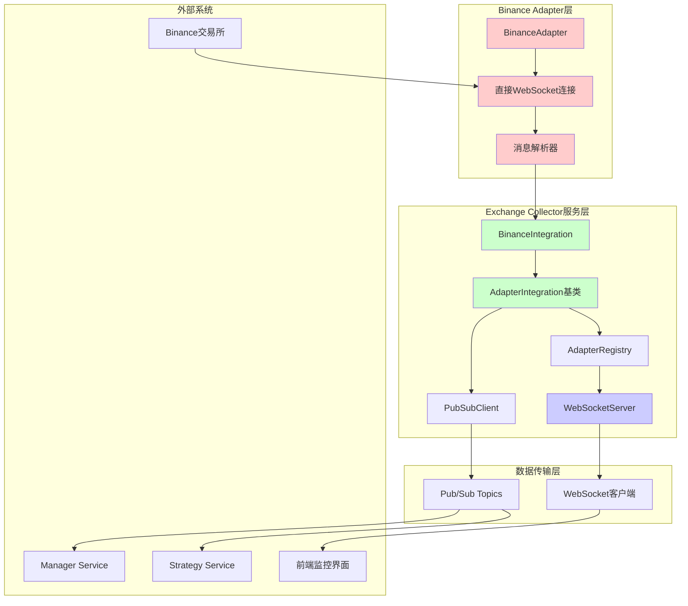
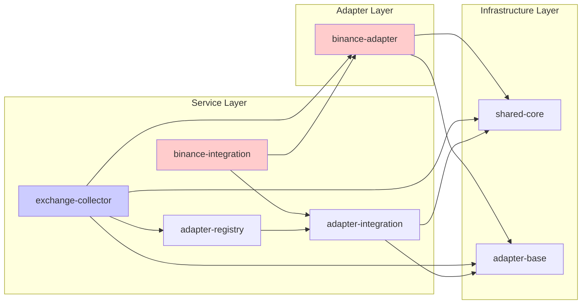

# Exchange Collector 系统深度架构分析报告

## 1. 当前数据流分析

### 1.1 完整数据流路径



### 1.2 数据转换和处理逻辑

1. **原始数据接收** (`BinanceAdapter.handleWebSocketMessage`, 行196-217)
   - 接收WebSocket原始消息
   - JSON解析和大小统计
   - 调用`parseMessage`进行数据解析

2. **消息解析** (`BinanceAdapter.parseMessage`, 行349-407)
   - 识别Binance Combined Stream格式
   - 根据事件类型(`e`字段)分类处理
   - 转换为标准化`MarketData`格式

3. **适配器集成处理** (`AdapterIntegration.processMarketData`, 行254-294)
   - 数据验证和质量检查
   - 数据标准化(交易所名称小写化、交易对大写化)
   - 缓冲或直接发布决策

4. **消息发布** (`AdapterIntegration.flushMessageBuffer`, 行333-394)
   - 按数据类型分组
   - 批量发布到不同的Pub/Sub主题
   - 指标更新和错误处理

5. **WebSocket转发** (`ExchangeCollectorService.setupDataStreamForwarding`, 行398-437)
   - 监听适配器数据处理事件
   - 构造WebSocket消息格式
   - 广播给前端客户端

## 2. 重复代码识别

### 2.1 WebSocket连接管理重复

**问题位置:**
- `BinanceAdapter.connectWebSocket()` (行136-191)
- `CollectorWebSocketServer` WebSocket处理 (行24-521)

**重复逻辑:**
- WebSocket连接建立和错误处理
- 心跳/Ping-Pong机制
- 连接超时管理
- 重连逻辑实现

**具体重复代码片段:**
```typescript
// BinanceAdapter.ts (行147-180)
const timeout = setTimeout(() => {
  this.ws?.close();
  reject(new Error('Connection timeout'));
}, this.config?.connection?.timeout || 10000);

this.ws.on('open', () => {
  clearTimeout(timeout);
  // ... 状态处理
});

this.ws.on('error', (error) => {
  clearTimeout(timeout);
  this.emit('error', error);
  // ... 重连调度
});

// CollectorWebSocketServer.ts (行396-428)
this.heartbeatInterval = setInterval(() => {
  const now = Date.now();
  const deadConnections: string[] = [];
  
  for (const [connectionId, connection] of this.connections) {
    if (connection.socket.readyState === WebSocket.OPEN) {
      // ... 超时检查和ping发送
    }
  }
}, this.HEARTBEAT_INTERVAL);
```

### 2.2 消息解析重复

**问题位置:**
- `BinanceAdapter.parseMessage()` (行349-407)
- `BinanceAdapter.parseCombinedStreamMessage()` (行367-407)
- `AdapterIntegration.processMarketData()` (行254-294)

**重复逻辑:**
- JSON消息解析和错误处理
- 数据类型识别和分类
- 时间戳处理和标准化

### 2.3 错误处理和重连机制重复

**问题位置:**
- `BinanceAdapter.scheduleReconnect()` (行232-251)
- `BaseAdapter.reconnect()` (行229-264)

**重复逻辑:**
- 指数退避重连算法
- 最大重试次数检查
- 错误状态管理

## 3. 架构问题分析

### 3.1 BinanceAdapter绕过adapter-base框架

**严重程度:** 🔴 Critical

**问题描述:**
`BinanceAdapter`类继承自`BaseAdapter`，但在关键方法中完全重写了基类的实现，绕过了框架设计：

- `initialize()` (行60-86): 跳过连接管理器初始化
- `connect()` (行112-131): 直接使用WebSocket而非ConnectionManager
- `createConnectionManager()` (行53-55): 返回空的BaseConnectionManager但未使用

**影响分析:**
1. 违反了适配器框架的抽象设计
2. 无法利用框架提供的连接管理、重连、心跳等功能
3. 增加了代码复杂度和维护成本
4. 其他交易所适配器可能会复制这种反模式

### 3.2 服务间耦合过紧

**严重程度:** 🟡 Major

**问题表现:**
1. **直接依赖耦合**: `BinanceIntegration`直接导入`BinanceAdapter`
2. **事件传递链过长**: Adapter → Integration → Registry → Service → WebSocket
3. **配置传递复杂**: 配置需要经过多层转换和传递

**耦合链路:**
```
BinanceAdapter → BinanceIntegration → AdapterRegistry → ExchangeCollectorService → WebSocketServer
```

### 3.3 配置管理分散

**严重程度:** 🟡 Major

**配置分散位置:**
1. 服务级配置 (`service-config.ts`)
2. 适配器配置 (`adapter-config.ts`) 
3. 集成配置 (`IntegrationConfig`)
4. Binance特定配置 (`BinanceConfig`)

**问题:**
- 配置验证逻辑重复
- 默认值设置不一致
- 配置更新需要修改多处

## 4. 依赖关系分析

### 4.1 依赖关系图



### 4.2 循环依赖分析

**当前未发现严重循环依赖，但存在风险:**
- `exchange-collector` → `binance-adapter` → `adapter-base` → `shared-core`
- 如果`shared-core`引用`exchange-collector`的类型，会形成循环

### 4.3 重构影响范围评估

**高影响组件:**
1. `BinanceAdapter` - 需要完全重构以遵循框架
2. `AdapterIntegration` - 需要简化数据流处理
3. `AdapterRegistry` - 需要优化实例管理

**中等影响组件:**
1. `ExchangeCollectorService` - 需要调整初始化流程
2. WebSocket相关组件 - 需要提取通用连接管理

**低影响组件:**
1. `shared-core` - 基础设施，影响最小
2. 配置相关组件 - 主要是配置整合

## 5. 性能问题识别

### 5.1 内存泄漏风险

**问题位置:**
- `BinanceAdapter.streamMap` 和 `activeStreams` 未及时清理
- `AdapterIntegration.messageBuffer` 在异常情况下可能积累
- WebSocket连接未正确清理监听器

### 5.2 CPU使用问题

**问题位置:**
- 每条消息都进行JSON解析和重新序列化
- 频繁的字符串操作(大小写转换、格式化)
- 过度的日志记录(每100条消息记录一次)

### 5.3 网络资源浪费

- WebSocket连接重建频繁
- 批量发布不够优化
- 心跳机制重复实现

## 6. 重构建议

### 6.1 短期优化 (1-2周)

1. **提取WebSocket连接管理器**
   ```typescript
   // 创建统一的WebSocket连接管理
   class UnifiedWebSocketManager {
     connect(url: string, options: ConnectionOptions): Promise<void>
     disconnect(): Promise<void>
     setupHeartbeat(interval: number): void
     onMessage(handler: MessageHandler): void
   }
   ```

2. **消息解析器标准化**
   ```typescript
   // 标准化消息解析接口
   interface MessageParser<T> {
     parse(rawMessage: any): MarketData | null
     validate(data: any): boolean
     normalize(data: any): T
   }
   ```

### 6.2 中期重构 (3-4周)

1. **适配器框架合规化**
   - 让`BinanceAdapter`正确使用`BaseAdapter`框架
   - 实现标准的`ConnectionManager`
   - 统一错误处理和重连逻辑

2. **配置系统统一**
   ```typescript
   // 统一配置管理
   class UnifiedConfigManager {
     loadAdapterConfig(exchange: string): AdapterConfig
     validateConfig(config: any): boolean
     mergeDefaults(config: any): AdapterConfig
   }
   ```

### 6.3 长期架构优化 (1-2月)

1. **引入数据处理管道**
   ```typescript
   // 数据处理管道模式
   class DataPipeline {
     addStage(stage: PipelineStage): this
     process(data: RawData): Promise<ProcessedData>
   }
   ```

2. **适配器插件化**
   - 动态加载适配器
   - 热插拔支持
   - 版本管理

## 7. 关键指标监控

### 7.1 建议监控指标

1. **连接指标**
   - WebSocket连接成功率
   - 重连频率和原因
   - 连接延迟分布

2. **数据流指标**
   - 消息处理吞吐量
   - 数据解析错误率
   - 发布延迟分布

3. **资源使用指标**
   - 内存使用趋势
   - CPU使用率峰值
   - 网络带宽使用

### 7.2 告警规则建议

```yaml
alerts:
  - name: adapter_connection_failure
    condition: adapter_status != 2 for 5m
    severity: critical
    
  - name: high_processing_latency  
    condition: adapter_processing_latency_ms > 1000
    severity: warning
    
  - name: low_data_quality
    condition: data_quality_score < 0.8
    severity: warning
```

## 8. 总结和优先级

### 8.1 问题优先级排序

1. **🔴 Critical**: BinanceAdapter绕过框架 - 架构违反，需要立即修复
2. **🟡 Major**: 服务间耦合过紧 - 影响可扩展性和维护性  
3. **🟡 Major**: 重复代码过多 - 增加维护成本和错误风险
4. **🟠 Minor**: 配置管理分散 - 影响开发体验和部署复杂度

### 8.2 重构收益评估

**预期收益:**
- 代码重用率提升40-50%
- 新交易所适配器开发时间缩短60%
- 系统稳定性提升(减少连接问题)
- 内存使用优化15-20%

**风险评估:**
- 重构期间可能影响数据收集稳定性
- 需要大量测试确保功能完整性
- 团队学习成本(新的架构模式)

**建议实施策略:**
1. 先进行小范围重构验证设计
2. 逐步替换现有组件
3. 保持向后兼容性
4. 完善监控和告警机制

这份分析报告为Exchange Collector系统的架构优化提供了详细的技术指导，建议按照优先级逐步实施改进。