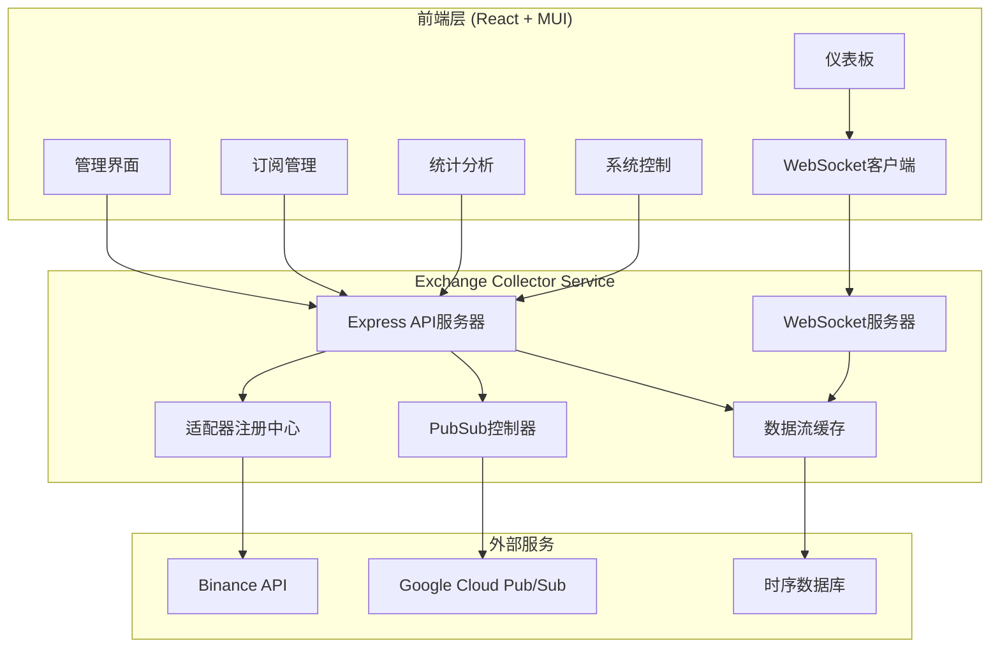
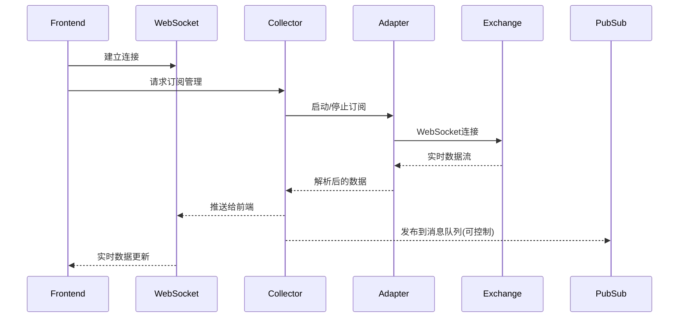

# Exchange Collector Web 前端管理界面设计文档

## 1. 项目概述

### 1.1 项目背景
Exchange Collector 是 Pixiu 量化交易系统中负责数据采集的核心服务，目前仅提供 REST API 和命令行接口。为了提升运维效率和系统可视化程度，需要开发一个 Web 前端管理界面。

### 1.2 核心需求
- **实时数据流监控**: 展示当前接收到的订阅数据流
- **订阅管理**: 允许动态增加或删除交易对订阅
- **统计信息展示**: 显示连接状态、数据量、延迟等关键指标
- **PubSub 控制**: 控制是否向 Google Cloud Pub/Sub 发布数据
- **系统监控**: 适配器状态、健康检查、错误日志

### 1.3 技术目标
- 部署到 Google Cloud Platform
- 响应式设计，支持移动端访问
- 实时数据更新，低延迟展示
- 用户友好的界面，使用 Material-UI 设计系统

## 2. 技术架构

### 2.1 技术栈选择

#### 前端技术栈
- **框架**: React 18 + TypeScript
- **UI 库**: Material-UI (MUI) v5 - 默认主题
- **状态管理**: React Context API + useReducer
- **实时通信**: WebSocket + Server-Sent Events
- **图表库**: Recharts (与 MUI 兼容)
- **HTTP 客户端**: Axios
- **构建工具**: Vite
- **代码质量**: ESLint + Prettier

#### 后端增强
- **WebSocket 服务器**: ws 库集成到现有 Express 服务
- **实时数据缓存**: 内存中数据缓存机制
- **新增 API 端点**: 订阅管理、统计数据、PubSub 控制

#### 部署技术栈
- **容器化**: Docker 多阶段构建
- **CI/CD**: Google Cloud Build
- **运行环境**: Google Cloud Run
- **域名和证书**: Google Cloud Load Balancer + SSL

### 2.2 系统架构图



### 2.3 数据流架构



## 3. 核心功能模块

### 3.1 仪表板 (Dashboard)

#### 功能描述
提供系统整体状态的一览视图，包括实时数据流、关键指标和系统健康状态。

#### 界面组件
- **实时数据卡片**: 显示最新的市场数据（价格、成交量等）
- **连接状态面板**: 各交易所连接状态和延迟
- **数据流量图表**: 实时数据接收速率折线图
- **错误率监控**: 错误率和重连统计
- **系统资源**: CPU、内存使用率

#### 实现细节
```typescript
interface DashboardData {
  marketData: {
    symbol: string;
    price: number;
    volume: number;
    timestamp: number;
  }[];
  connectionStatus: {
    exchange: string;
    status: 'connected' | 'disconnected' | 'reconnecting';
    latency: number;
    uptime: number;
  }[];
  metrics: {
    messagesPerSecond: number;
    errorRate: number;
    totalMessages: number;
  };
  systemHealth: {
    cpu: number;
    memory: number;
    connections: number;
  };
}
```

### 3.2 订阅管理 (Subscription Management)

#### 功能描述
动态管理交易对订阅，支持批量操作和订阅策略配置。

#### 界面组件
- **订阅列表**: 当前活跃订阅的表格视图
- **添加订阅**: 交易所和交易对选择器
- **批量操作**: 批量启用/禁用订阅
- **订阅配置**: 数据类型选择（行情、深度、成交等）

#### API 接口设计
```typescript
// 获取当前订阅
GET /api/subscriptions
Response: {
  subscriptions: {
    exchange: string;
    symbol: string;
    dataTypes: string[];
    status: 'active' | 'paused' | 'error';
    metrics: {
      messagesReceived: number;
      lastUpdate: string;
    };
  }[];
}

// 添加订阅
POST /api/subscriptions
Body: {
  exchange: string;
  symbol: string;
  dataTypes: string[];
}

// 删除订阅
DELETE /api/subscriptions/:exchange/:symbol

// 批量操作
POST /api/subscriptions/batch
Body: {
  action: 'start' | 'stop' | 'delete';
  subscriptions: { exchange: string; symbol: string; }[];
}
```

### 3.3 统计分析 (Statistics & Analytics)

#### 功能描述
提供详细的系统运行统计和性能分析，支持历史数据查询。

#### 界面组件
- **性能图表**: 吞吐量、延迟分布图
- **历史统计**: 可选择时间范围的历史数据
- **交易所对比**: 不同交易所的性能对比
- **数据质量**: 丢包率、重复数据统计

#### 图表实现
```typescript
import { LineChart, Line, XAxis, YAxis, CartesianGrid, Tooltip, Legend } from 'recharts';

const ThroughputChart: React.FC<{ data: MetricsData[] }> = ({ data }) => {
  return (
    <LineChart width={800} height={400} data={data}>
      <CartesianGrid strokeDasharray="3 3" />
      <XAxis dataKey="timestamp" />
      <YAxis />
      <Tooltip />
      <Legend />
      <Line type="monotone" dataKey="messagesPerSecond" stroke="#8884d8" />
      <Line type="monotone" dataKey="errorRate" stroke="#82ca9d" />
    </LineChart>
  );
};
```

### 3.4 系统控制 (System Control)

#### 功能描述
提供系统级别的控制功能，包括 PubSub 开关、适配器管理等。

#### 界面组件
- **PubSub 控制**: 全局开关控制数据发布
- **适配器管理**: 启动/停止/重启适配器
- **配置管理**: 动态配置更新
- **日志查看**: 实时日志流和历史日志

#### 控制接口
```typescript
// PubSub 控制
POST /api/pubsub/toggle
Body: { enabled: boolean }

// 适配器控制
POST /api/adapters/:name/start
POST /api/adapters/:name/stop
POST /api/adapters/:name/restart

// 配置更新
PUT /api/config
Body: { section: string; config: object }
```

## 4. 后端 API 增强

### 4.1 WebSocket 服务器集成

#### 实现方案
将 WebSocket 服务器集成到现有的 Express 应用中，复用监控和错误处理机制。

```typescript
// src/websocket/websocket-server.ts
import { WebSocketServer } from 'ws';
import { Server } from 'http';

export class CollectorWebSocketServer {
  private wss: WebSocketServer;
  private clients: Set<WebSocket> = new Set();
  
  constructor(server: Server) {
    this.wss = new WebSocketServer({ server, path: '/ws' });
    this.setupEventHandlers();
  }
  
  private setupEventHandlers(): void {
    this.wss.on('connection', (ws) => {
      this.clients.add(ws);
      
      ws.on('close', () => {
        this.clients.delete(ws);
      });
      
      ws.on('message', (data) => {
        this.handleMessage(ws, data);
      });
    });
  }
  
  broadcast(data: any): void {
    const message = JSON.stringify(data);
    this.clients.forEach(client => {
      if (client.readyState === WebSocket.OPEN) {
        client.send(message);
      }
    });
  }
}
```

### 4.2 数据流缓存机制

#### 设计思路
在内存中维护最近的市场数据，支持多种数据类型的缓存和快速查询。

```typescript
// src/cache/data-stream-cache.ts
interface CacheEntry<T> {
  data: T;
  timestamp: number;
  source: string;
}

export class DataStreamCache {
  private cache: Map<string, CacheEntry<any>[]> = new Map();
  private maxSize: number = 1000;
  private ttl: number = 300000; // 5分钟
  
  set<T>(key: string, data: T, source: string): void {
    const entry: CacheEntry<T> = {
      data,
      timestamp: Date.now(),
      source
    };
    
    if (!this.cache.has(key)) {
      this.cache.set(key, []);
    }
    
    const entries = this.cache.get(key)!;
    entries.push(entry);
    
    // 限制缓存大小
    if (entries.length > this.maxSize) {
      entries.shift();
    }
    
    // 清理过期数据
    this.cleanExpired(key);
  }
  
  get<T>(key: string, limit?: number): CacheEntry<T>[] {
    const entries = this.cache.get(key) || [];
    this.cleanExpired(key);
    return limit ? entries.slice(-limit) : entries;
  }
  
  getLatest<T>(key: string): T | null {
    const entries = this.get<T>(key, 1);
    return entries.length > 0 ? entries[0].data : null;
  }
}
```

### 4.3 新增 API 端点

#### 订阅管理 API
```typescript
// src/api/subscriptions.ts
import { Router } from 'express';

export function createSubscriptionRouter(): Router {
  const router = Router();
  
  router.get('/', getSubscriptions);
  router.post('/', addSubscription);
  router.delete('/:exchange/:symbol', removeSubscription);
  router.post('/batch', batchOperation);
  
  return router;
}
```

#### 实时统计 API
```typescript
// src/api/stats.ts
export function createStatsRouter(): Router {
  const router = Router();
  
  router.get('/current', getCurrentStats);
  router.get('/history', getHistoryStats);
  router.get('/stream', setupStatsStream); // SSE
  
  return router;
}
```

## 5. 前端应用实现

### 5.1 项目结构

```
frontend/
├── public/
│   ├── index.html
│   └── favicon.ico
├── src/
│   ├── components/
│   │   ├── common/
│   │   │   ├── Layout.tsx
│   │   │   ├── Navigation.tsx
│   │   │   └── ErrorBoundary.tsx
│   │   ├── dashboard/
│   │   │   ├── Dashboard.tsx
│   │   │   ├── MarketDataCard.tsx
│   │   │   ├── ConnectionStatus.tsx
│   │   │   └── MetricsChart.tsx
│   │   ├── subscriptions/
│   │   │   ├── SubscriptionManager.tsx
│   │   │   ├── SubscriptionList.tsx
│   │   │   └── AddSubscription.tsx
│   │   ├── statistics/
│   │   │   ├── StatisticsView.tsx
│   │   │   ├── PerformanceCharts.tsx
│   │   │   └── HistoryAnalysis.tsx
│   │   └── control/
│   │       ├── SystemControl.tsx
│   │       ├── PubSubControl.tsx
│   │       └── AdapterControl.tsx
│   ├── contexts/
│   │   ├── AppContext.tsx
│   │   ├── WebSocketContext.tsx
│   │   └── DataContext.tsx
│   ├── hooks/
│   │   ├── useWebSocket.ts
│   │   ├── useApi.ts
│   │   └── useRealTimeData.ts
│   ├── services/
│   │   ├── api.ts
│   │   ├── websocket.ts
│   │   └── types.ts
│   ├── utils/
│   │   ├── formatters.ts
│   │   ├── constants.ts
│   │   └── theme.ts
│   ├── App.tsx
│   └── index.tsx
├── package.json
├── tsconfig.json
├── vite.config.ts
└── Dockerfile
```

### 5.2 核心组件实现

#### App.tsx - 主应用组件
```typescript
import React from 'react';
import { ThemeProvider, CssBaseline } from '@mui/material';
import { BrowserRouter as Router, Routes, Route } from 'react-router-dom';
import { AppProvider } from './contexts/AppContext';
import { WebSocketProvider } from './contexts/WebSocketContext';
import Layout from './components/common/Layout';
import Dashboard from './components/dashboard/Dashboard';
import SubscriptionManager from './components/subscriptions/SubscriptionManager';
import StatisticsView from './components/statistics/StatisticsView';
import SystemControl from './components/control/SystemControl';
import { theme } from './utils/theme';

const App: React.FC = () => {
  return (
    <ThemeProvider theme={theme}>
      <CssBaseline />
      <AppProvider>
        <WebSocketProvider>
          <Router>
            <Layout>
              <Routes>
                <Route path="/" element={<Dashboard />} />
                <Route path="/subscriptions" element={<SubscriptionManager />} />
                <Route path="/statistics" element={<StatisticsView />} />
                <Route path="/control" element={<SystemControl />} />
              </Routes>
            </Layout>
          </Router>
        </WebSocketProvider>
      </AppProvider>
    </ThemeProvider>
  );
};

export default App;
```

#### WebSocket Context - 实时数据管理
```typescript
import React, { createContext, useContext, useEffect, useReducer } from 'react';

interface WebSocketState {
  connected: boolean;
  marketData: MarketData[];
  connectionStatus: ConnectionStatus[];
  metrics: SystemMetrics;
}

type WebSocketAction = 
  | { type: 'CONNECT' }
  | { type: 'DISCONNECT' }
  | { type: 'MARKET_DATA'; payload: MarketData }
  | { type: 'CONNECTION_STATUS'; payload: ConnectionStatus[] }
  | { type: 'METRICS'; payload: SystemMetrics };

const WebSocketContext = createContext<{
  state: WebSocketState;
  send: (message: any) => void;
} | null>(null);

export const WebSocketProvider: React.FC<{ children: React.ReactNode }> = ({ children }) => {
  const [state, dispatch] = useReducer(webSocketReducer, initialState);
  const [socket, setSocket] = useState<WebSocket | null>(null);
  
  useEffect(() => {
    const ws = new WebSocket(`${process.env.REACT_APP_WS_URL}/ws`);
    
    ws.onopen = () => dispatch({ type: 'CONNECT' });
    ws.onclose = () => dispatch({ type: 'DISCONNECT' });
    ws.onmessage = (event) => {
      const data = JSON.parse(event.data);
      handleWebSocketMessage(data, dispatch);
    };
    
    setSocket(ws);
    
    return () => ws.close();
  }, []);
  
  const send = (message: any) => {
    if (socket && socket.readyState === WebSocket.OPEN) {
      socket.send(JSON.stringify(message));
    }
  };
  
  return (
    <WebSocketContext.Provider value={{ state, send }}>
      {children}
    </WebSocketContext.Provider>
  );
};
```

#### Dashboard 组件
```typescript
import React from 'react';
import { Grid, Paper, Typography, Box } from '@mui/material';
import { useWebSocket } from '../hooks/useWebSocket';
import MarketDataCard from './MarketDataCard';
import ConnectionStatus from './ConnectionStatus';
import MetricsChart from './MetricsChart';

const Dashboard: React.FC = () => {
  const { state } = useWebSocket();
  
  return (
    <Box sx={{ flexGrow: 1, p: 3 }}>
      <Typography variant="h4" gutterBottom>
        实时数据监控
      </Typography>
      
      <Grid container spacing={3}>
        {/* 市场数据卡片 */}
        <Grid item xs={12} md={8}>
          <Paper sx={{ p: 2 }}>
            <Typography variant="h6" gutterBottom>
              实时市场数据
            </Typography>
            <Grid container spacing={2}>
              {state.marketData.map((data, index) => (
                <Grid item xs={12} sm={6} md={4} key={index}>
                  <MarketDataCard data={data} />
                </Grid>
              ))}
            </Grid>
          </Paper>
        </Grid>
        
        {/* 连接状态 */}
        <Grid item xs={12} md={4}>
          <Paper sx={{ p: 2 }}>
            <Typography variant="h6" gutterBottom>
              连接状态
            </Typography>
            <ConnectionStatus connections={state.connectionStatus} />
          </Paper>
        </Grid>
        
        {/* 性能指标图表 */}
        <Grid item xs={12}>
          <Paper sx={{ p: 2 }}>
            <Typography variant="h6" gutterBottom>
              系统性能指标
            </Typography>
            <MetricsChart metrics={state.metrics} />
          </Paper>
        </Grid>
      </Grid>
    </Box>
  );
};

export default Dashboard;
```

### 5.3 自定义 Hooks

#### useWebSocket Hook
```typescript
import { useContext } from 'react';
import { WebSocketContext } from '../contexts/WebSocketContext';

export const useWebSocket = () => {
  const context = useContext(WebSocketContext);
  if (!context) {
    throw new Error('useWebSocket must be used within WebSocketProvider');
  }
  return context;
};
```

#### useApi Hook
```typescript
import { useState, useCallback } from 'react';
import axios from 'axios';

interface ApiState<T> {
  data: T | null;
  loading: boolean;
  error: string | null;
}

export const useApi = <T>() => {
  const [state, setState] = useState<ApiState<T>>({
    data: null,
    loading: false,
    error: null
  });
  
  const execute = useCallback(async (request: () => Promise<T>) => {
    setState({ data: null, loading: true, error: null });
    
    try {
      const result = await request();
      setState({ data: result, loading: false, error: null });
      return result;
    } catch (error) {
      const errorMessage = error instanceof Error ? error.message : '未知错误';
      setState({ data: null, loading: false, error: errorMessage });
      throw error;
    }
  }, []);
  
  return { ...state, execute };
};
```

## 6. 部署方案

### 6.1 Docker 配置

#### 多阶段构建 Dockerfile
```dockerfile
# 阶段1: 构建前端
FROM node:18-alpine AS frontend-builder

WORKDIR /app/frontend
COPY frontend/package*.json ./
RUN npm ci --only=production

COPY frontend/ ./
RUN npm run build

# 阶段2: 构建后端
FROM node:18-alpine AS backend-builder

WORKDIR /app
COPY package*.json ./
COPY services/data-collection/exchange-collector/package*.json ./services/data-collection/exchange-collector/
RUN npm ci --only=production

# 阶段3: 生产环境
FROM node:18-alpine AS production

WORKDIR /app

# 复制后端代码
COPY services/data-collection/exchange-collector/ ./
COPY --from=backend-builder /app/node_modules ./node_modules

# 复制前端构建结果
COPY --from=frontend-builder /app/frontend/dist ./public

# 构建后端
RUN npm run build

# 配置静态文件服务
COPY deployment/nginx.conf /etc/nginx/nginx.conf

# 健康检查
HEALTHCHECK --interval=30s --timeout=3s --start-period=5s --retries=3 \
  CMD curl -f http://localhost:8080/health || exit 1

EXPOSE 8080

CMD ["npm", "start"]
```

### 6.2 Google Cloud Build 配置

#### cloudbuild.yaml
```yaml
steps:
  # 构建 Docker 镜像
  - name: 'gcr.io/cloud-builders/docker'
    args: [
      'build',
      '-t', 'gcr.io/$PROJECT_ID/exchange-collector-web:$COMMIT_SHA',
      '-t', 'gcr.io/$PROJECT_ID/exchange-collector-web:latest',
      '-f', 'deployment/Dockerfile.web',
      '.'
    ]

  # 推送镜像到 Container Registry
  - name: 'gcr.io/cloud-builders/docker'
    args: ['push', 'gcr.io/$PROJECT_ID/exchange-collector-web:$COMMIT_SHA']
  
  - name: 'gcr.io/cloud-builders/docker'
    args: ['push', 'gcr.io/$PROJECT_ID/exchange-collector-web:latest']

  # 部署到 Cloud Run
  - name: 'gcr.io/google.com/cloudsdktool/cloud-sdk'
    entrypoint: 'gcloud'
    args: [
      'run', 'deploy', 'exchange-collector-web',
      '--image', 'gcr.io/$PROJECT_ID/exchange-collector-web:$COMMIT_SHA',
      '--region', 'asia-northeast1',
      '--platform', 'managed',
      '--allow-unauthenticated',
      '--set-env-vars', 'NODE_ENV=production',
      '--set-env-vars', 'GOOGLE_CLOUD_PROJECT=$PROJECT_ID',
      '--memory', '1Gi',
      '--cpu', '1',
      '--concurrency', '100',
      '--timeout', '300s'
    ]

options:
  logging: CLOUD_LOGGING_ONLY
  machineType: 'E2_HIGHCPU_8'

timeout: '1200s'
```

### 6.3 Cloud Run 部署配置

#### service.yaml
```yaml
apiVersion: serving.knative.dev/v1
kind: Service
metadata:
  name: exchange-collector-web
  namespace: default
  annotations:
    run.googleapis.com/ingress: all
    run.googleapis.com/cpu-throttling: "false"
spec:
  template:
    metadata:
      annotations:
        autoscaling.knative.dev/minScale: "1"
        autoscaling.knative.dev/maxScale: "10"
        run.googleapis.com/execution-environment: gen2
    spec:
      containerConcurrency: 100
      timeoutSeconds: 300
      serviceAccountName: exchange-collector-sa
      containers:
      - image: gcr.io/PROJECT_ID/exchange-collector-web:latest
        ports:
        - containerPort: 8080
        env:
        - name: NODE_ENV
          value: "production"
        - name: GOOGLE_CLOUD_PROJECT
          value: "PROJECT_ID"
        - name: PUBSUB_EMULATOR_HOST
          value: ""
        resources:
          limits:
            cpu: "1"
            memory: "1Gi"
        livenessProbe:
          httpGet:
            path: /health
            port: 8080
          initialDelaySeconds: 30
          periodSeconds: 30
        readinessProbe:
          httpGet:
            path: /health
            port: 8080
          initialDelaySeconds: 5
          periodSeconds: 10
```

### 6.4 负载均衡和 SSL 配置

#### Load Balancer 配置
```yaml
# load-balancer.yaml
apiVersion: networking.gke.io/v1
kind: ManagedCertificate
metadata:
  name: exchange-collector-ssl-cert
spec:
  domains:
    - exchange-collector.example.com

---
apiVersion: networking.k8s.io/v1
kind: Ingress
metadata:
  name: exchange-collector-ingress
  annotations:
    kubernetes.io/ingress.global-static-ip-name: "exchange-collector-ip"
    networking.gke.io/managed-certificates: exchange-collector-ssl-cert
    kubernetes.io/ingress.class: "gce"
spec:
  rules:
  - host: exchange-collector.example.com
    http:
      paths:
      - path: /*
        pathType: ImplementationSpecific
        backend:
          service:
            name: exchange-collector-web
            port:
              number: 80
```

## 7. 安全考虑

### 7.1 认证和授权

#### JWT 认证集成
```typescript
// src/middleware/auth.ts
import jwt from 'jsonwebtoken';
import { Request, Response, NextFunction } from 'express';

interface AuthRequest extends Request {
  user?: any;
}

export const authenticateToken = (req: AuthRequest, res: Response, next: NextFunction) => {
  const authHeader = req.headers['authorization'];
  const token = authHeader && authHeader.split(' ')[1];
  
  if (!token) {
    return res.sendStatus(401);
  }
  
  jwt.verify(token, process.env.JWT_SECRET as string, (err, user) => {
    if (err) return res.sendStatus(403);
    req.user = user;
    next();
  });
};

// 权限验证
export const requireRole = (role: string) => {
  return (req: AuthRequest, res: Response, next: NextFunction) => {
    if (!req.user || req.user.role !== role) {
      return res.sendStatus(403);
    }
    next();
  };
};
```

### 7.2 API 安全

#### 请求限制和验证
```typescript
import rateLimit from 'express-rate-limit';
import helmet from 'helmet';

// 安全中间件
app.use(helmet({
  contentSecurityPolicy: {
    directives: {
      defaultSrc: ["'self'"],
      styleSrc: ["'self'", "'unsafe-inline'", "fonts.googleapis.com"],
      fontSrc: ["'self'", "fonts.gstatic.com"],
      scriptSrc: ["'self'"],
      connectSrc: ["'self'", "wss:", "ws:"]
    }
  }
}));

// 请求限制
const limiter = rateLimit({
  windowMs: 15 * 60 * 1000, // 15分钟
  max: 100, // 限制每个IP 100个请求
  message: '请求过于频繁，请稍后再试'
});

app.use('/api', limiter);
```

### 7.3 WebSocket 安全

#### 连接验证和消息过滤
```typescript
// WebSocket 连接验证
wss.on('connection', (ws, request) => {
  // 验证 Origin
  const origin = request.headers.origin;
  if (!isAllowedOrigin(origin)) {
    ws.close(1008, 'Invalid origin');
    return;
  }
  
  // 验证认证 token
  const token = extractTokenFromQuery(request.url);
  if (!verifyToken(token)) {
    ws.close(1008, 'Authentication failed');
    return;
  }
  
  // 限制消息频率
  const messageQueue = new Map();
  ws.on('message', (data) => {
    if (isRateLimited(ws, messageQueue)) {
      ws.close(1008, 'Rate limit exceeded');
      return;
    }
    handleMessage(ws, data);
  });
});
```

## 8. 性能优化

### 8.1 前端性能优化

#### 代码分割和懒加载
```typescript
import { lazy, Suspense } from 'react';
import { CircularProgress, Box } from '@mui/material';

// 懒加载组件
const Dashboard = lazy(() => import('./components/dashboard/Dashboard'));
const SubscriptionManager = lazy(() => import('./components/subscriptions/SubscriptionManager'));
const StatisticsView = lazy(() => import('./components/statistics/StatisticsView'));

// 加载指示器
const LoadingFallback = () => (
  <Box display="flex" justifyContent="center" alignItems="center" height="100vh">
    <CircularProgress />
  </Box>
);

// 路由配置
<Suspense fallback={<LoadingFallback />}>
  <Routes>
    <Route path="/" element={<Dashboard />} />
    <Route path="/subscriptions" element={<SubscriptionManager />} />
    <Route path="/statistics" element={<StatisticsView />} />
  </Routes>
</Suspense>
```

#### 数据虚拟化
```typescript
import { FixedSizeList as List } from 'react-window';

const VirtualizedList: React.FC<{ items: any[] }> = ({ items }) => {
  const Row = ({ index, style }: { index: number; style: any }) => (
    <div style={style}>
      {/* 渲染单个列表项 */}
      <ListItem data={items[index]} />
    </div>
  );
  
  return (
    <List
      height={400}
      itemCount={items.length}
      itemSize={60}
      width="100%"
    >
      {Row}
    </List>
  );
};
```

### 8.2 后端性能优化

#### 数据缓存策略
```typescript
import NodeCache from 'node-cache';

class PerformanceOptimizer {
  private cache = new NodeCache({ stdTTL: 60 }); // 1分钟缓存
  private memoryThreshold = 0.8; // 80% 内存阈值
  
  getCachedData<T>(key: string, generator: () => T): T {
    let data = this.cache.get<T>(key);
    
    if (!data) {
      data = generator();
      this.cache.set(key, data);
    }
    
    return data;
  }
  
  checkMemoryUsage(): void {
    const usage = process.memoryUsage();
    const ratio = usage.heapUsed / usage.heapTotal;
    
    if (ratio > this.memoryThreshold) {
      this.cache.flushAll();
      global.gc && global.gc();
    }
  }
}
```

#### WebSocket 连接池
```typescript
class WebSocketConnectionPool {
  private connections = new Set<WebSocket>();
  private maxConnections = 1000;
  
  addConnection(ws: WebSocket): boolean {
    if (this.connections.size >= this.maxConnections) {
      return false;
    }
    
    this.connections.add(ws);
    
    ws.on('close', () => {
      this.connections.delete(ws);
    });
    
    return true;
  }
  
  broadcast(data: any): void {
    const message = JSON.stringify(data);
    const deadConnections: WebSocket[] = [];
    
    this.connections.forEach(ws => {
      if (ws.readyState === WebSocket.OPEN) {
        ws.send(message);
      } else {
        deadConnections.push(ws);
      }
    });
    
    // 清理死连接
    deadConnections.forEach(ws => this.connections.delete(ws));
  }
}
```

## 9. 监控和日志

### 9.1 前端监控

#### 错误监控和性能追踪
```typescript
// src/utils/monitoring.ts
class FrontendMonitor {
  private errorHandler: (error: Error, errorInfo: any) => void;
  
  constructor() {
    this.setupErrorHandling();
    this.setupPerformanceMonitoring();
  }
  
  private setupErrorHandling(): void {
    window.addEventListener('error', (event) => {
      this.logError({
        type: 'javascript_error',
        message: event.error?.message,
        stack: event.error?.stack,
        filename: event.filename,
        lineno: event.lineno
      });
    });
    
    window.addEventListener('unhandledrejection', (event) => {
      this.logError({
        type: 'promise_rejection',
        reason: event.reason
      });
    });
  }
  
  private setupPerformanceMonitoring(): void {
    // 页面加载性能
    window.addEventListener('load', () => {
      setTimeout(() => {
        const perfData = performance.getEntriesByType('navigation')[0];
        this.logPerformance({
          type: 'page_load',
          loadTime: perfData.loadEventEnd - perfData.loadEventStart,
          domContentLoaded: perfData.domContentLoadedEventEnd - perfData.domContentLoadedEventStart
        });
      }, 0);
    });
  }
  
  logError(error: any): void {
    console.error('Frontend Error:', error);
    // 发送到后端日志服务
    fetch('/api/logs/error', {
      method: 'POST',
      headers: { 'Content-Type': 'application/json' },
      body: JSON.stringify(error)
    });
  }
  
  logPerformance(data: any): void {
    console.log('Performance Data:', data);
    // 发送到后端监控服务
    fetch('/api/logs/performance', {
      method: 'POST',
      headers: { 'Content-Type': 'application/json' },
      body: JSON.stringify(data)
    });
  }
}
```

### 9.2 后端监控增强

#### 集成现有监控系统
```typescript
// src/monitoring/web-monitor.ts
export class WebMonitor extends BaseMonitor {
  private httpMetrics = {
    requests: this.prometheus.createCounter({
      name: 'http_requests_total',
      help: 'Total HTTP requests',
      labelNames: ['method', 'path', 'status']
    }),
    duration: this.prometheus.createHistogram({
      name: 'http_request_duration_seconds',
      help: 'HTTP request duration',
      labelNames: ['method', 'path']
    }),
    websocketConnections: this.prometheus.createGauge({
      name: 'websocket_connections_total',
      help: 'Total WebSocket connections'
    })
  };
  
  recordHttpRequest(method: string, path: string, status: number, duration: number): void {
    this.httpMetrics.requests.labels(method, path, status.toString()).inc();
    this.httpMetrics.duration.labels(method, path).observe(duration / 1000);
  }
  
  updateWebSocketConnections(count: number): void {
    this.httpMetrics.websocketConnections.set(count);
  }
}
```

## 10. 测试策略

### 10.1 前端测试

#### 组件测试
```typescript
// tests/components/Dashboard.test.tsx
import { render, screen } from '@testing-library/react';
import { ThemeProvider } from '@mui/material';
import Dashboard from '../src/components/dashboard/Dashboard';
import { theme } from '../src/utils/theme';

const MockedDashboard = () => (
  <ThemeProvider theme={theme}>
    <Dashboard />
  </ThemeProvider>
);

describe('Dashboard Component', () => {
  it('renders market data cards', () => {
    render(<MockedDashboard />);
    expect(screen.getByText('实时市场数据')).toBeInTheDocument();
  });
  
  it('displays connection status', () => {
    render(<MockedDashboard />);
    expect(screen.getByText('连接状态')).toBeInTheDocument();
  });
});
```

#### E2E 测试
```typescript
// e2e/dashboard.spec.ts
import { test, expect } from '@playwright/test';

test.describe('Dashboard Page', () => {
  test('should display real-time data', async ({ page }) => {
    await page.goto('/');
    
    // 等待页面加载
    await page.waitForSelector('[data-testid="market-data-card"]');
    
    // 验证实时数据更新
    const initialPrice = await page.textContent('[data-testid="price"]');
    await page.waitForTimeout(5000);
    const updatedPrice = await page.textContent('[data-testid="price"]');
    
    expect(initialPrice).not.toBe(updatedPrice);
  });
  
  test('should handle WebSocket connection', async ({ page }) => {
    await page.goto('/');
    
    // 验证 WebSocket 连接状态
    const connectionStatus = page.locator('[data-testid="connection-status"]');
    await expect(connectionStatus).toHaveText('已连接');
  });
});
```

### 10.2 后端 API 测试

#### 集成测试
```typescript
// tests/api/subscriptions.test.ts
import request from 'supertest';
import { app } from '../src/app';

describe('Subscription API', () => {
  it('should get current subscriptions', async () => {
    const response = await request(app)
      .get('/api/subscriptions')
      .expect(200);
      
    expect(response.body).toHaveProperty('subscriptions');
    expect(Array.isArray(response.body.subscriptions)).toBe(true);
  });
  
  it('should add new subscription', async () => {
    const subscription = {
      exchange: 'binance',
      symbol: 'BTCUSDT',
      dataTypes: ['ticker', 'depth']
    };
    
    const response = await request(app)
      .post('/api/subscriptions')
      .send(subscription)
      .expect(201);
      
    expect(response.body).toHaveProperty('success', true);
  });
});
```

## 11. 实施计划

### 11.1 Phase 1: 后端 API 增强 (2-3 天)

#### 任务清单
- [ ] 集成 WebSocket 服务器到现有 Express 应用
- [ ] 实现数据流缓存机制
- [ ] 添加订阅管理 API (`/api/subscriptions`)
- [ ] 实现实时统计 API (`/api/stats`)
- [ ] 添加 PubSub 控制 API (`/api/pubsub/toggle`)
- [ ] 编写 API 单元测试和集成测试

#### 技术细节
1. **WebSocket 集成**: 使用现有的 Express 服务器创建 WebSocket 服务器
2. **数据缓存**: 实现内存缓存，支持 TTL 和容量限制
3. **API 设计**: RESTful API 设计，支持批量操作
4. **错误处理**: 集成现有的错误处理机制

### 11.2 Phase 2: 前端应用开发 (3-4 天)

#### 任务清单
- [ ] 创建 React + TypeScript + MUI 项目结构
- [ ] 实现 WebSocket 连接和状态管理
- [ ] 开发仪表板组件 (Dashboard)
- [ ] 实现订阅管理界面 (Subscription Management)
- [ ] 添加统计图表组件 (Statistics & Charts)
- [ ] 开发系统控制界面 (System Control)
- [ ] 实现响应式设计和移动端适配

#### 技术细节
1. **状态管理**: 使用 React Context + useReducer
2. **实时数据**: WebSocket + SSE 双重保障
3. **UI 组件**: Material-UI 默认主题
4. **图表库**: Recharts 集成

### 11.3 Phase 3: 集成与测试 (1-2 天)

#### 任务清单
- [ ] 前后端集成测试
- [ ] WebSocket 连接稳定性测试
- [ ] 实时数据流性能测试
- [ ] 用户界面响应性优化
- [ ] 错误处理和边界情况测试
- [ ] 安全性测试 (认证、授权、XSS 防护)

#### 测试策略
1. **单元测试**: 前后端组件单元测试
2. **集成测试**: API 集成测试
3. **E2E 测试**: 完整用户流程测试
4. **性能测试**: 负载和压力测试

### 11.4 Phase 4: 部署配置 (1-2 天)

#### 任务清单
- [ ] 创建 Docker 多阶段构建配置
- [ ] 配置 Google Cloud Build CI/CD
- [ ] 设置 Cloud Run 部署
- [ ] 配置负载均衡和 SSL 证书
- [ ] 设置监控和日志收集
- [ ] 编写部署和运维文档

#### 部署流程
1. **本地测试**: Docker 本地构建和测试
2. **CI/CD 配置**: Cloud Build 自动化构建
3. **生产部署**: Cloud Run 部署和配置
4. **域名配置**: 负载均衡器和 SSL 设置

## 12. 预期交付物

### 12.1 代码交付物
1. **增强的 Exchange Collector 服务**: 包含 WebSocket 和新 API 的完整后端
2. **React Web 管理界面**: 完整的前端应用
3. **部署配置文件**: Docker, Cloud Build, Cloud Run 配置
4. **测试套件**: 单元测试、集成测试、E2E 测试

### 12.2 文档交付物
1. **部署指南**: 完整的部署步骤和配置说明
2. **用户手册**: Web 界面使用说明
3. **API 文档**: 新增 API 接口文档
4. **运维指南**: 监控、日志、故障排除

### 12.3 监控和运维
1. **性能监控**: 集成 Google Cloud Monitoring
2. **日志收集**: 结构化日志和错误追踪
3. **告警配置**: 关键指标告警设置
4. **健康检查**: 自动化健康检查和恢复

## 13. 风险评估和缓解策略

### 13.1 技术风险
1. **WebSocket 连接稳定性**: 实现重连机制和连接池管理
2. **实时数据性能**: 数据缓存和批量处理优化
3. **内存使用**: 内存监控和自动清理机制

### 13.2 部署风险
1. **Cloud Run 冷启动**: 最小实例数配置
2. **网络延迟**: CDN 和就近部署
3. **SSL 证书**: 自动化证书管理

### 13.3 安全风险
1. **XSS 攻击**: CSP 策略和输入验证
2. **CSRF 攻击**: CSRF 令牌和 SameSite cookie
3. **DDoS 攻击**: 请求限制和 Cloud Armor 防护

---

## 总结

这个设计文档提供了为 Exchange Collector 开发 Web 前端管理界面的完整技术方案。项目采用现代化的技术栈，注重性能、安全性和可维护性，能够满足实时数据监控、订阅管理、统计分析和系统控制的需求。

通过分阶段的实施计划，可以在 7-11 天内完成整个项目的开发和部署，为 Pixiu 量化交易系统提供强大的可视化管理工具。