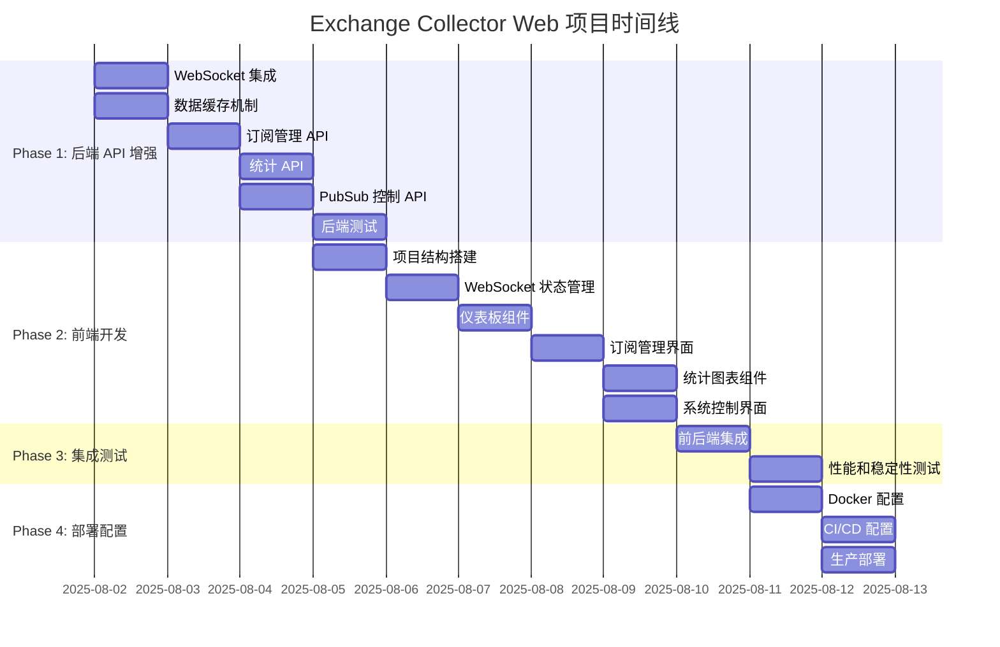

# Exchange Collector Web 前端管理界面项目任务列表

基于 [Exchange Collector Web 前端管理界面设计文档](./exchange-collector-web-frontend-design.md) 制定的详细实施计划。

## 项目概述

**项目目标**: 为 Exchange Collector 开发 Web 前端管理界面  
**技术栈**: React 18 + TypeScript + Material-UI + WebSocket + Express + Docker + Google Cloud  
**预计工期**: 7-11 天  
**团队规模**: 1-2 人

## 阶段划分

### Phase 1: 后端 API 增强 (2-3 天)
### Phase 2: 前端应用开发 (3-4 天)  
### Phase 3: 集成与测试 (1-2 天)
### Phase 4: 部署配置 (1-2 天)

---

## Phase 1: 后端 API 增强 (2-3 天)

### 🔥 高优先级任务

#### 1.1 集成 WebSocket 服务器到现有 Express 应用
- **文件位置**: `services/data-collection/exchange-collector/src/websocket/`
- **关键组件**:
  - `websocket-server.ts` - WebSocket 服务器类
  - `connection-pool.ts` - 连接池管理
  - `message-handler.ts` - 消息处理逻辑
- **技术要点**:
  - 使用 `ws` 库集成到现有 Express HTTP 服务器
  - 实现客户端连接管理和消息广播
  - 集成现有的错误处理和监控机制
- **验收标准**:
  - WebSocket 服务器在 `/ws` 路径可用
  - 支持多客户端连接管理
  - 能够向所有连接的客户端广播消息

#### 1.2 实现数据流缓存机制 (DataStreamCache)
- **文件位置**: `services/data-collection/exchange-collector/src/cache/`
- **关键组件**:
  - `data-stream-cache.ts` - 核心缓存类
  - `cache-entry.ts` - 缓存条目类型定义
  - `cache-manager.ts` - 缓存管理器
- **技术要点**:
  - 内存中缓存最近的市场数据
  - 支持 TTL (5分钟) 和容量限制 (1000条)
  - 自动清理过期数据
- **验收标准**:
  - 能够存储和检索不同类型的市场数据
  - 自动清理过期和超量数据
  - 提供快速的最新数据查询接口

#### 1.3 添加订阅管理 API (/api/subscriptions)
- **文件位置**: `services/data-collection/exchange-collector/src/api/`
- **关键端点**:
  - `GET /api/subscriptions` - 获取当前订阅列表
  - `POST /api/subscriptions` - 添加新订阅
  - `DELETE /api/subscriptions/:exchange/:symbol` - 删除订阅
  - `POST /api/subscriptions/batch` - 批量操作
- **技术要点**:
  - 集成现有的适配器注册系统
  - 支持动态启动/停止订阅
  - 提供订阅状态和指标信息
- **验收标准**:
  - 所有 API 端点返回正确的 JSON 格式
  - 能够动态管理 Binance 适配器订阅
  - 批量操作支持启动/停止/删除

### 🟡 中优先级任务

#### 1.4 实现实时统计 API (/api/stats)
- **文件位置**: `services/data-collection/exchange-collector/src/api/`
- **关键端点**:
  - `GET /api/stats/current` - 当前系统统计
  - `GET /api/stats/history` - 历史统计数据
  - `GET /api/stats/stream` - SSE 实时统计流
- **技术要点**:
  - 集成现有的监控指标收集
  - 实现 Server-Sent Events 流
  - 提供系统性能和连接状态数据
- **验收标准**:
  - 返回实时的系统指标数据
  - SSE 流能够实时推送统计更新
  - 支持历史数据查询

#### 1.5 添加 PubSub 控制 API (/api/pubsub/toggle)
- **文件位置**: `services/data-collection/exchange-collector/src/api/`
- **关键端点**:
  - `POST /api/pubsub/toggle` - 控制 PubSub 发布开关
  - `GET /api/pubsub/status` - 获取当前发布状态
- **技术要点**:
  - 动态控制向 Google Cloud Pub/Sub 的数据发布
  - 维护发布状态持久化
- **验收标准**:
  - 能够动态开启/关闭 PubSub 数据发布
  - 状态变更立即生效
  - 提供当前发布状态查询

#### 1.6 编写后端 API 单元测试和集成测试
- **文件位置**: `services/data-collection/exchange-collector/tests/api/`
- **测试覆盖**:
  - WebSocket 连接和消息处理测试
  - 数据缓存机制测试
  - 所有新增 API 端点测试
- **验收标准**:
  - 测试覆盖率 > 80%
  - 所有 API 端点有完整的集成测试
  - Mock 外部依赖进行单元测试

---

## Phase 2: 前端应用开发 (3-4 天)

### 🔥 高优先级任务

#### 2.1 创建 React + TypeScript + MUI 前端项目结构
- **项目位置**: `services/data-collection/exchange-collector/frontend/`
- **关键文件**:
  - `package.json` - 依赖配置
  - `tsconfig.json` - TypeScript 配置
  - `vite.config.ts` - Vite 构建配置
  - `src/` 目录结构
- **技术要点**:
  - React 18 + TypeScript 严格模式
  - Material-UI v5 默认主题
  - Vite 作为构建工具
  - ESLint + Prettier 代码质量
- **验收标准**:
  - 项目结构符合设计文档规范
  - 能够成功启动开发服务器
  - 代码质量工具配置正确

#### 2.2 实现 WebSocket 连接和状态管理
- **关键组件**:
  - `src/contexts/WebSocketContext.tsx` - WebSocket 上下文
  - `src/hooks/useWebSocket.ts` - WebSocket Hook
  - `src/services/websocket.ts` - WebSocket 服务
- **技术要点**:
  - React Context API + useReducer 状态管理
  - 自动重连机制
  - 消息类型化处理
- **验收标准**:
  - 能够建立和维护 WebSocket 连接
  - 实现自动重连和错误处理
  - 提供类型安全的消息处理

#### 2.3 开发仪表板组件
- **关键组件**:
  - `src/components/dashboard/Dashboard.tsx` - 主仪表板
  - `src/components/dashboard/MarketDataCard.tsx` - 市场数据卡片
  - `src/components/dashboard/ConnectionStatus.tsx` - 连接状态
  - `src/components/dashboard/MetricsChart.tsx` - 指标图表
- **技术要点**:
  - Material-UI Grid 响应式布局
  - 实时数据展示和更新
  - Recharts 图表集成
- **验收标准**:
  - 显示实时市场数据卡片
  - 展示各交易所连接状态
  - 渲染系统性能指标图表

#### 2.4 实现订阅管理界面
- **关键组件**:
  - `src/components/subscriptions/SubscriptionManager.tsx` - 订阅管理器
  - `src/components/subscriptions/SubscriptionList.tsx` - 订阅列表
  - `src/components/subscriptions/AddSubscription.tsx` - 添加订阅
- **技术要点**:
  - Material-UI Table 组件
  - 表单验证和提交
  - 批量操作支持
- **验收标准**:
  - 显示当前活跃订阅列表
  - 支持添加/删除单个订阅
  - 支持批量启用/禁用操作

### 🟡 中优先级任务

#### 2.5 添加统计图表组件
- **关键组件**:
  - `src/components/statistics/StatisticsView.tsx` - 统计视图
  - `src/components/statistics/PerformanceCharts.tsx` - 性能图表
  - `src/components/statistics/HistoryAnalysis.tsx` - 历史分析
- **技术要点**:
  - Recharts 多种图表类型
  - 时间范围选择器
  - 数据导出功能
- **验收标准**:
  - 显示吞吐量和延迟图表
  - 支持历史数据查询
  - 提供交易所性能对比

#### 2.6 开发系统控制界面
- **关键组件**:
  - `src/components/control/SystemControl.tsx` - 系统控制
  - `src/components/control/PubSubControl.tsx` - PubSub 控制
  - `src/components/control/AdapterControl.tsx` - 适配器控制
- **技术要点**:
  - 开关控件和按钮操作
  - 实时状态反馈
  - 确认对话框
- **验收标准**:
  - PubSub 开关控制正常工作
  - 适配器启动/停止/重启功能
  - 操作结果实时反馈

### 🟢 低优先级任务

#### 2.7 实现响应式设计和移动端适配
- **技术要点**:
  - Material-UI 响应式断点
  - 移动端导航优化
  - 触摸友好的交互
- **验收标准**:
  - 在手机和平板上正常显示
  - 导航菜单适配小屏幕
  - 图表在移动端可读

---

## Phase 3: 集成与测试 (1-2 天)

### 🔥 高优先级任务

#### 3.1 前后端集成测试
- **测试范围**:
  - API 调用和响应验证
  - WebSocket 消息传递
  - 数据流端到端测试
- **验收标准**:
  - 前端能够成功调用所有后端 API
  - WebSocket 实时数据流正常工作
  - 错误情况正确处理

#### 3.2 WebSocket 连接稳定性测试
- **测试场景**:
  - 网络中断和重连
  - 服务器重启恢复
  - 多客户端并发连接
- **验收标准**:
  - 自动重连机制工作正常
  - 连接池管理稳定
  - 消息丢失率 < 1%

### 🟡 中优先级任务

#### 3.3 实时数据流性能测试
- **测试指标**:
  - 高频数据处理能力
  - 内存使用监控
  - UI 渲染性能
- **验收标准**:
  - 支持 > 100 msg/s 数据流
  - 内存使用稳定在合理范围
  - UI 更新不卡顿

#### 3.4 用户界面响应性优化
- **优化项目**:
  - 代码分割和懒加载
  - 虚拟化长列表
  - 图片和资源优化
- **验收标准**:
  - 首屏加载时间 < 3s
  - 页面切换响应时间 < 500ms
  - 大数据列表渲染流畅

#### 3.5 错误处理和边界情况测试
- **测试场景**:
  - 网络断开恢复
  - 服务器错误响应
  - 组件错误边界
- **验收标准**:
  - 错误信息用户友好
  - 系统能够从错误中恢复
  - 不会因单个错误导致整体崩溃

#### 3.6 安全性测试
- **测试项目**:
  - JWT 认证流程
  - CORS 策略
  - CSP 安全策略
  - XSS 防护
- **验收标准**:
  - 未授权访问被正确阻止
  - 安全头设置正确
  - 输入验证和输出编码

---

## Phase 4: 部署配置 (1-2 天)

### 🔥 高优先级任务

#### 4.1 创建 Docker 多阶段构建配置
- **文件位置**: `deployment/Dockerfile.web`
- **构建阶段**:
  - 前端构建阶段 (Node.js Alpine)
  - 后端构建阶段 (Node.js Alpine)
  - 生产运行阶段 (Node.js Alpine)
- **验收标准**:
  - Docker 镜像构建成功
  - 镜像大小优化合理
  - 健康检查配置正确

#### 4.2 配置 Google Cloud Build CI/CD
- **文件位置**: `deployment/cloudbuild.yaml`
- **构建步骤**:
  - Docker 镜像构建
  - 推送到 Container Registry
  - 自动部署到 Cloud Run
- **验收标准**:
  - 代码提交触发自动构建
  - 构建成功推送到注册表
  - 自动部署到运行环境

#### 4.3 设置 Cloud Run 部署
- **文件位置**: `deployment/service.yaml`
- **配置项目**:
  - 容器端口和环境变量
  - 资源限制和自动缩放
  - 健康检查和探针
- **验收标准**:
  - 服务成功部署到 Cloud Run
  - 健康检查通过
  - 能够通过公网访问

### 🟡 中优先级任务

#### 4.4 配置负载均衡和 SSL 证书
- **文件位置**: `deployment/load-balancer.yaml`
- **配置项目**:
  - Ingress 配置
  - ManagedCertificate 自动 SSL
  - 静态 IP 和域名绑定
- **验收标准**:
  - HTTPS 访问正常
  - SSL 证书自动更新
  - 域名解析正确

#### 4.5 设置监控和日志收集
- **配置项目**:
  - Google Cloud Monitoring 集成
  - 结构化日志输出
  - 关键指标告警
- **验收标准**:
  - 监控指标正常收集
  - 日志可查询和分析
  - 告警配置生效

### 🟢 低优先级任务

#### 4.6 编写部署和运维文档
- **文档内容**:
  - 部署指南和步骤
  - 用户使用手册
  - API 接口文档
  - 运维故障排除指南
- **验收标准**:
  - 文档内容完整准确
  - 步骤可复现
  - 覆盖常见问题

---

## 交付检查清单

### 📋 代码交付物
- [ ] **增强的 Exchange Collector 服务** - 包含 WebSocket 和新 API 的完整后端
- [ ] **React Web 管理界面** - 完整的前端应用
- [ ] **部署配置文件** - Docker, Cloud Build, Cloud Run 配置
- [ ] **测试套件** - 单元测试、集成测试、E2E 测试

### 📋 文档交付物
- [ ] **部署指南** - 完整的部署步骤和配置说明
- [ ] **用户手册** - Web 界面使用说明
- [ ] **API 文档** - 新增 API 接口文档
- [ ] **运维指南** - 监控、日志、故障排除

### 📋 功能验收标准
- [ ] **实时数据监控** - 仪表板显示实时市场数据和系统状态
- [ ] **订阅管理** - 支持动态添加/删除交易对订阅
- [ ] **统计分析** - 显示系统性能和历史数据分析
- [ ] **系统控制** - PubSub 开关和适配器管理
- [ ] **移动端适配** - 响应式设计支持移动端访问

### 📋 非功能性验收标准
- [ ] **性能** - 支持 > 100 msg/s 实时数据流，UI 响应时间 < 500ms
- [ ] **可靠性** - 系统可用性 > 99%，自动故障恢复
- [ ] **安全性** - JWT 认证，HTTPS 加密，XSS 防护
- [ ] **可扩展性** - 支持 10 个并发用户，自动扩缩容

---

## 风险和缓解措施

### ⚠️ 技术风险
| 风险 | 影响 | 概率 | 缓解措施 |
|------|------|------|----------|
| WebSocket 连接不稳定 | 高 | 中 | 实现重连机制和连接池管理 |
| 实时数据性能瓶颈 | 中 | 中 | 数据缓存和批量处理优化 |
| 内存泄漏 | 中 | 低 | 内存监控和自动清理机制 |

### ⚠️ 部署风险
| 风险 | 影响 | 概率 | 缓解措施 |
|------|------|------|----------|
| Cloud Run 冷启动延迟 | 中 | 高 | 配置最小实例数 |
| 网络延迟影响体验 | 低 | 中 | CDN 和就近部署 |
| SSL 证书配置错误 | 低 | 低 | 自动化证书管理 |

### ⚠️ 进度风险
| 风险 | 影响 | 概率 | 缓解措施 |
|------|------|------|----------|
| 前端开发时间超预期 | 高 | 中 | 优先核心功能，可选功能后期迭代 |
| 测试发现重大问题 | 中 | 中 | 增量开发，持续测试 |
| 第三方依赖问题 | 低 | 低 | 提前验证关键依赖 |

---

## 项目时间线

---

**项目负责人**: 开发团队  
**文档维护**: 项目经理  
**最后更新**: 2025-08-02