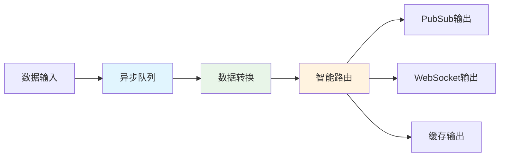
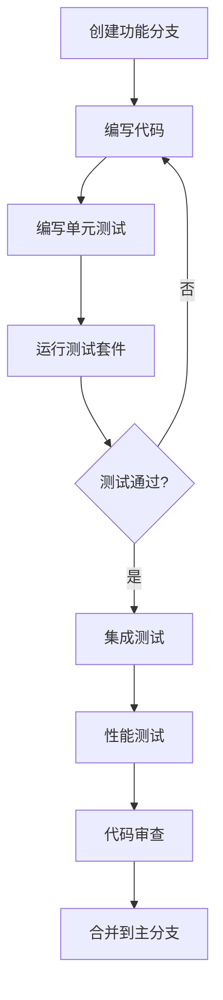

# Exchange Collector 开发者指南

## 开发概述

Exchange Collector v2.0采用现代化的DataFlow架构，提供了强大的扩展能力和开发友好的API。本指南涵盖基于新架构的开发方法、最佳实践和常见开发场景。

### 开发环境要求

- **Node.js**: >= 18.0.0
- **TypeScript**: >= 4.9.0
- **npm**: >= 8.0.0
- **Redis**: >= 6.0.0 (用于缓存和会话)
- **Docker**: >= 20.10.0 (可选，用于容器化开发)

## 项目结构

```
services/data-collection/exchange-collector/
├── src/
│   ├── adapters/                 # 适配器层
│   │   ├── base/                 # 基础适配器接口
│   │   ├── binance/              # Binance适配器
│   │   └── registry/             # 适配器注册表
│   ├── dataflow/                 # DataFlow核心
│   │   ├── channels/             # 输出通道
│   │   ├── monitoring/           # 监控组件
│   │   ├── routing/              # 消息路由
│   │   └── transformers/         # 数据转换器
│   ├── config/                   # 配置管理
│   ├── websocket/                # WebSocket服务
│   └── api/                      # REST API
├── tests/                        # 测试代码
├── tools/                        # 开发工具
└── docs/                         # 文档
```

## 核心开发概念

### 1. DataFlow架构

DataFlow是v2.0的核心架构模式，提供统一的数据处理管道：



#### DataFlow核心组件

```typescript
// src/dataflow/interfaces.ts
export interface DataFlowManager {
  processData(data: MarketData, source?: string): Promise<void>;
  addRoute(rule: RoutingRule): void;
  getStats(): DataFlowStats;
}

export interface MarketData {
  exchange: string;
  symbol: string;
  dataType: DataType;
  timestamp: number;
  data: any;
  metadata?: {
    quality_score?: number;
    source_latency?: number;
    [key: string]: any;
  };
}

export enum DataType {
  TICKER = 'ticker',
  ORDERBOOK = 'orderbook', 
  TRADE = 'trade',
  KLINE = 'kline'
}
```

### 2. 适配器框架

所有交易所适配器都基于标准化的适配器框架：

```typescript
// 基础适配器接口
import { BaseAdapter } from '@pixiu/adapter-base';

export abstract class ExchangeAdapter extends BaseAdapter {
  abstract getName(): string;
  abstract getVersion(): string;
  
  // 连接管理
  abstract connect(): Promise<void>;
  abstract disconnect(): Promise<void>;
  abstract isConnected(): boolean;
  
  // 订阅管理  
  abstract subscribeToMarketData(subscription: MarketDataSubscription): Promise<void>;
  abstract unsubscribe(subscriptionId: string): Promise<void>;
  
  // 数据处理
  protected emitMarketData(data: MarketData): void {
    this.emit('marketData', data);
  }
}
```

## 开发工作流程

### 1. 开发环境搭建

#### 使用npm workspace
```bash
# 克隆项目
git clone https://github.com/your-org/pixiu.git
cd pixiu

# 安装所有依赖
npm install

# 启动开发服务
npm run dev -w @pixiu/exchange-collector
```

#### 使用Docker开发环境
```bash
# 启动开发环境
cd deployment/docker-compose
docker-compose -f docker-compose.dev.yml up -d

# 查看服务状态
docker-compose -f docker-compose.dev.yml ps

# 查看应用日志
docker-compose -f docker-compose.dev.yml logs -f exchange-collector
```

### 2. 代码开发流程



### 3. 测试驱动开发

#### 单元测试示例
```typescript
// tests/unit/dataflow/data-flow-manager.test.ts
import { DataFlowManager } from '../../../src/dataflow/data-flow-manager';
import { createMockTransformer, createMockChannels } from '../../utils/mocks';

describe('DataFlowManager', () => {
  let dataFlowManager: DataFlowManager;
  let mockTransformer: any;
  let mockChannels: any;

  beforeEach(() => {
    mockTransformer = createMockTransformer();
    mockChannels = createMockChannels();
    
    dataFlowManager = new DataFlowManager({
      transformer: mockTransformer,
      channels: mockChannels,
      performance: {
        maxQueueSize: 1000,
        enableBackpressure: true
      }
    });
  });

  it('should process market data through pipeline', async () => {
    const testData = {
      exchange: 'binance',
      symbol: 'BTCUSDT',
      dataType: DataType.TICKER,
      timestamp: Date.now(),
      data: { price: 50000, volume: 100 }
    };

    await dataFlowManager.processData(testData);
    
    expect(mockTransformer.transform).toHaveBeenCalledWith(testData);
    expect(mockChannels.send).toHaveBeenCalled();
  });

  it('should handle backpressure when queue is full', async () => {
    // 填满队列
    const promises = Array(1100).fill(null).map((_, i) => 
      dataFlowManager.processData({
        exchange: 'test',
        symbol: 'TEST',
        dataType: DataType.TICKER,
        timestamp: Date.now(),
        data: { id: i }
      })
    );

    // 应该触发背压
    await expect(Promise.all(promises)).rejects.toThrow('Queue full');
  });
});
```

## 常见开发场景

### 1. 创建新的交易所适配器

#### 步骤1: 创建适配器类
```typescript
// src/adapters/okx/okx-adapter.ts
import { ExchangeAdapter } from '../base/exchange-adapter';
import { OKXConnectionManager } from './okx-connection-manager';

export class OKXAdapter extends ExchangeAdapter {
  private connectionManager: OKXConnectionManager;

  constructor(config: OKXConfig) {
    super(config);
    this.connectionManager = new OKXConnectionManager(config);
  }

  getName(): string {
    return 'okx';
  }

  getVersion(): string {
    return '1.0.0';
  }

  async connect(): Promise<void> {
    await this.connectionManager.connect();
    this.setupEventHandlers();
  }

  async disconnect(): Promise<void> {
    await this.connectionManager.disconnect();
  }

  isConnected(): boolean {
    return this.connectionManager.isConnected();
  }

  async subscribeToMarketData(subscription: MarketDataSubscription): Promise<void> {
    const channel = this.buildChannel(subscription);
    await this.connectionManager.subscribe(channel);
  }

  private setupEventHandlers(): void {
    this.connectionManager.on('message', (rawData) => {
      const marketData = this.parseMarketData(rawData);
      if (marketData) {
        this.emitMarketData(marketData);
      }
    });

    this.connectionManager.on('error', (error) => {
      this.emit('error', error);
    });
  }

  private parseMarketData(rawData: any): MarketData | null {
    try {
      // OKX特定的数据解析逻辑
      return {
        exchange: 'okx',
        symbol: rawData.instId,
        dataType: this.getDataType(rawData.channel),
        timestamp: Date.now(),
        data: this.transformData(rawData),
        metadata: {
          source_latency: Date.now() - rawData.ts
        }
      };
    } catch (error) {
      this.logger.error('Failed to parse OKX data:', error);
      return null;
    }
  }
}
```

#### 步骤2: 创建连接管理器
```typescript
// src/adapters/okx/okx-connection-manager.ts
import { BaseConnectionManager } from '@pixiu/adapter-base';
import WebSocket from 'ws';

export class OKXConnectionManager extends BaseConnectionManager {
  private ws: WebSocket | null = null;
  private readonly baseUrl = 'wss://ws.okx.com:8443/ws/v5/public';

  async connect(): Promise<void> {
    return new Promise((resolve, reject) => {
      this.ws = new WebSocket(this.baseUrl);
      
      this.ws.on('open', () => {
        this.status = ConnectionStatus.CONNECTED;
        this.emit('connected');
        resolve();
      });

      this.ws.on('message', (data) => {
        const parsed = JSON.parse(data.toString());
        this.emit('message', parsed);
      });

      this.ws.on('error', (error) => {
        this.emit('error', error);
        reject(error);
      });
    });
  }

  async subscribe(channel: string): Promise<void> {
    if (!this.isConnected()) {
      throw new Error('Not connected');
    }

    const subscribeMessage = {
      op: 'subscribe',
      args: [{ channel }]
    };

    this.ws!.send(JSON.stringify(subscribeMessage));
  }
}
```

#### 步骤3: 注册适配器
```typescript
// src/adapters/registry/adapter-registry.ts
import { OKXAdapter } from '../okx/okx-adapter';

export class AdapterRegistry {
  private adapters = new Map<string, ExchangeAdapter>();

  registerAdapter(name: string, adapter: ExchangeAdapter): void {
    this.adapters.set(name, adapter);
  }

  createOKXAdapter(config: OKXConfig): OKXAdapter {
    const adapter = new OKXAdapter(config);
    this.registerAdapter('okx', adapter);
    return adapter;
  }
}
```

### 2. 创建自定义数据转换器

```typescript
// src/dataflow/transformers/custom-transformer.ts
import { DataTransformer, MarketData } from '../interfaces';

export class CustomDataTransformer implements DataTransformer {
  async transform(data: MarketData): Promise<MarketData> {
    // 自定义转换逻辑
    const transformedData = {
      ...data,
      // 添加自定义字段
      customField: this.calculateCustomMetric(data),
      // 标准化价格精度
      data: {
        ...data.data,
        price: this.normalizePrice(data.data.price, data.symbol)
      },
      // 添加质量评分
      metadata: {
        ...data.metadata,
        quality_score: this.calculateQualityScore(data),
        transformation_time: Date.now()
      }
    };

    return transformedData;
  }

  private calculateCustomMetric(data: MarketData): number {
    // 实现自定义指标计算
    switch (data.dataType) {
      case DataType.TICKER:
        return data.data.volume / data.data.price;
      case DataType.TRADE:
        return data.data.quantity * data.data.price;
      default:
        return 0;
    }
  }

  private normalizePrice(price: number, symbol: string): number {
    // 根据交易对标准化价格精度
    const precision = this.getPricePrecision(symbol);
    return Math.round(price * Math.pow(10, precision)) / Math.pow(10, precision);
  }

  private calculateQualityScore(data: MarketData): number {
    let score = 1.0;
    
    // 检查数据完整性
    if (!data.data.price || data.data.price <= 0) {
      score *= 0.5;
    }
    
    // 检查延迟
    const latency = data.metadata?.source_latency || 0;
    if (latency > 1000) {
      score *= 0.8;
    }
    
    return Math.max(0, Math.min(1, score));
  }
}
```

### 3. 创建自定义输出通道

```typescript
// src/dataflow/channels/custom-output-channel.ts
import { OutputChannel, MarketData } from '../interfaces';

export class DatabaseOutputChannel implements OutputChannel {
  private db: DatabaseConnection;
  private batchBuffer: MarketData[] = [];
  private batchSize = 100;
  private flushTimer: NodeJS.Timeout | null = null;

  constructor(dbConfig: DatabaseConfig) {
    this.db = new DatabaseConnection(dbConfig);
  }

  async initialize(): Promise<void> {
    await this.db.connect();
    this.startBatchFlushTimer();
  }

  async send(data: MarketData[]): Promise<void> {
    this.batchBuffer.push(...data);
    
    if (this.batchBuffer.length >= this.batchSize) {
      await this.flushBatch();
    }
  }

  async close(): Promise<void> {
    if (this.flushTimer) {
      clearInterval(this.flushTimer);
    }
    
    if (this.batchBuffer.length > 0) {
      await this.flushBatch();
    }
    
    await this.db.disconnect();
  }

  private async flushBatch(): Promise<void> {
    if (this.batchBuffer.length === 0) return;
    
    const batch = [...this.batchBuffer];
    this.batchBuffer = [];
    
    try {
      await this.db.insertBatch('market_data', batch);
    } catch (error) {
      console.error('Failed to write batch to database:', error);
      // 可以选择重新加入缓冲区或丢弃
      throw error;
    }
  }

  private startBatchFlushTimer(): void {
    this.flushTimer = setInterval(async () => {
      await this.flushBatch();
    }, 5000); // 每5秒刷新一次
  }
}
```

### 4. 扩展路由规则

```typescript
// src/dataflow/routing/custom-routing-rules.ts
import { RoutingRule, MarketData } from '../interfaces';

export class CustomRoutingRules {
  // 高价值交易对路由
  static highValuePairsRule: RoutingRule = {
    name: 'high-value-pairs',
    condition: (data: MarketData) => {
      const highValuePairs = ['BTCUSDT', 'ETHUSDT', 'BNBUSDT'];
      return highValuePairs.includes(data.symbol);
    },
    channels: ['pubsub', 'websocket', 'cache', 'database'],
    priority: 1,
    options: {
      enableCompression: true,
      enableBatching: false // 高价值数据不批处理
    }
  };

  // 大额交易路由
  static largeTradeRule: RoutingRule = {
    name: 'large-trades',
    condition: (data: MarketData) => {
      return data.dataType === DataType.TRADE && 
             data.data.quantity * data.data.price > 100000; // $100k+
    },
    channels: ['pubsub', 'websocket', 'alert'],
    priority: 1,
    options: {
      enableRealTimeAlert: true
    }
  };

  // 异常数据路由
  static anomalyDetectionRule: RoutingRule = {
    name: 'anomaly-detection',
    condition: (data: MarketData) => {
      const qualityScore = data.metadata?.quality_score || 1;
      return qualityScore < 0.5;
    },
    channels: ['anomaly-detection'],
    priority: 2,
    options: {
      enableLogging: true,
      logLevel: 'warn'
    }
  };

  // 时间窗口路由
  static timeBasedRule: RoutingRule = {
    name: 'peak-hours',
    condition: (data: MarketData) => {
      const hour = new Date().getHours();
      return hour >= 9 && hour <= 16; // 市场活跃时间
    },
    channels: ['pubsub', 'websocket', 'cache'],
    priority: 3,
    options: {
      enableHighFrequencyMode: true
    }
  };
}
```

## 调试和测试

### 1. 本地调试

#### 使用调试器
```typescript
// 在代码中添加调试断点
debugger;

// 或使用console调试
console.log('Debug data:', JSON.stringify(data, null, 2));
```

#### 启动调试模式
```bash
# 使用Node.js调试器
npm run dev:debug

# 使用VS Code调试
# 在.vscode/launch.json中配置
{
  "type": "node",
  "request": "launch",
  "name": "Debug Exchange Collector",
  "program": "${workspaceFolder}/src/index.ts",
  "env": {
    "NODE_ENV": "development",
    "LOG_LEVEL": "debug"
  }
}
```

### 2. 单元测试编写

#### 测试工具使用
```typescript
// 使用增强的Mock工厂
import { EnhancedMockFactory } from '../utils/enhanced-mock-factory';

describe('CustomAdapter', () => {
  let adapter: CustomAdapter;
  let mockConnectionManager: any;
  
  beforeEach(() => {
    mockConnectionManager = EnhancedMockFactory.createConnectionManagerMock();
    adapter = new CustomAdapter({
      connectionManager: mockConnectionManager
    });
  });

  it('should parse market data correctly', () => {
    const rawData = {
      symbol: 'BTCUSDT',
      price: '50000',
      volume: '100'
    };

    const parsed = adapter.parseMarketData(rawData);
    
    expect(parsed).toMatchObject({
      exchange: 'custom',
      symbol: 'BTCUSDT',
      data: {
        price: 50000,
        volume: 100
      }
    });
  });
});
```

### 3. 性能测试

```typescript
// tools/performance-test.ts
import { PerformanceMonitor } from '../src/utils/performance-monitor';

async function runPerformanceTest() {
  const monitor = new PerformanceMonitor();
  const dataFlowManager = new DataFlowManager(config);
  
  // 性能测试配置
  const testConfig = {
    messageCount: 10000,
    concurrency: 100,
    duration: 60000 // 60秒
  };

  console.log('开始性能测试...');
  
  const startTime = Date.now();
  const promises = [];
  
  for (let i = 0; i < testConfig.concurrency; i++) {
    promises.push(generateTestLoad(dataFlowManager, testConfig.messageCount));
  }
  
  await Promise.all(promises);
  
  const endTime = Date.now();
  const duration = endTime - startTime;
  const throughput = (testConfig.messageCount * testConfig.concurrency) / (duration / 1000);
  
  console.log(`性能测试完成:`);
  console.log(`- 总消息数: ${testConfig.messageCount * testConfig.concurrency}`);
  console.log(`- 测试时长: ${duration}ms`);
  console.log(`- 吞吐量: ${throughput.toFixed(2)} msg/sec`);
  console.log(`- 内存使用: ${process.memoryUsage().heapUsed / 1024 / 1024} MB`);
}

async function generateTestLoad(dataFlowManager: DataFlowManager, count: number) {
  for (let i = 0; i < count; i++) {
    const testData = {
      exchange: 'test',
      symbol: 'TESTUSDT',
      dataType: DataType.TICKER,
      timestamp: Date.now(),
      data: {
        price: 50000 + Math.random() * 1000,
        volume: Math.random() * 1000
      }
    };
    
    await dataFlowManager.processData(testData);
  }
}
```

## 代码规范

### 1. TypeScript规范

```typescript
// 使用严格的类型定义
interface StrictConfig {
  readonly apiKey: string;
  readonly secretKey: string;
  readonly endpoints: {
    readonly rest: string;
    readonly websocket: string;
  };
}

// 使用泛型提高代码复用性
class GenericAdapter<T extends ExchangeConfig> extends BaseAdapter {
  constructor(private config: T) {
    super();
  }
  
  protected getConfig(): T {
    return this.config;
  }
}

// 使用联合类型而不是any
type SupportedExchange = 'binance' | 'okx' | 'huobi' | 'kucoin';

// 使用断言和类型守卫
function isValidMarketData(data: any): data is MarketData {
  return data && 
         typeof data.exchange === 'string' &&
         typeof data.symbol === 'string' &&
         typeof data.timestamp === 'number';
}
```

### 2. 错误处理规范

```typescript
// 自定义错误类
export class AdapterError extends Error {
  constructor(
    message: string,
    public readonly code: string,
    public readonly exchange: string,
    public readonly cause?: Error
  ) {
    super(message);
    this.name = 'AdapterError';
  }
}

// 错误处理最佳实践
export class BinanceAdapter extends ExchangeAdapter {
  async subscribeToMarketData(subscription: MarketDataSubscription): Promise<void> {
    try {
      await this.connectionManager.subscribe(subscription);
    } catch (error) {
      // 包装和重新抛出错误
      throw new AdapterError(
        `Failed to subscribe to ${subscription.symbol}`,
        'SUBSCRIPTION_FAILED',
        'binance',
        error as Error
      );
    }
  }

  private handleError(error: Error): void {
    // 结构化错误日志
    this.logger.error('Adapter error occurred', {
      error: error.message,
      stack: error.stack,
      exchange: this.getName(),
      timestamp: new Date().toISOString()
    });

    // 发出错误事件
    this.emit('error', error);
  }
}
```

### 3. 日志规范

```typescript
// 使用结构化日志
import { Logger } from '@pixiu/shared-core';

export class ExampleService {
  private logger = Logger.getLogger('ExampleService');

  async processData(data: MarketData): Promise<void> {
    // 使用不同日志级别
    this.logger.debug('Processing market data', {
      exchange: data.exchange,
      symbol: data.symbol,
      dataType: data.dataType
    });

    try {
      await this.doProcess(data);
      
      this.logger.info('Data processed successfully', {
        exchange: data.exchange,
        symbol: data.symbol,
        processingTime: Date.now() - data.timestamp
      });
    } catch (error) {
      this.logger.error('Failed to process data', {
        exchange: data.exchange,
        symbol: data.symbol,
        error: error.message,
        stack: error.stack
      });
      throw error;
    }
  }
}
```

## 最佳实践

### 1. 性能优化

```typescript
// 使用对象池减少GC压力
class MarketDataPool {
  private pool: MarketData[] = [];
  
  acquire(): MarketData {
    return this.pool.pop() || this.createNew();
  }
  
  release(data: MarketData): void {
    this.reset(data);
    if (this.pool.length < 1000) {
      this.pool.push(data);
    }
  }
  
  private createNew(): MarketData {
    return {
      exchange: '',
      symbol: '',
      dataType: DataType.TICKER,
      timestamp: 0,
      data: {},
      metadata: {}
    };
  }
  
  private reset(data: MarketData): void {
    data.exchange = '';
    data.symbol = '';
    data.timestamp = 0;
    data.data = {};
    data.metadata = {};
  }
}

// 使用异步批处理
class BatchProcessor {
  private batch: MarketData[] = [];
  private batchSize = 50;
  private flushInterval = 1000;
  
  constructor() {
    setInterval(() => this.flush(), this.flushInterval);
  }
  
  add(data: MarketData): void {
    this.batch.push(data);
    if (this.batch.length >= this.batchSize) {
      this.flush();
    }
  }
  
  private async flush(): Promise<void> {
    if (this.batch.length === 0) return;
    
    const currentBatch = this.batch.splice(0);
    
    try {
      await this.processBatch(currentBatch);
    } catch (error) {
      console.error('Batch processing failed:', error);
    }
  }
}
```

### 2. 内存管理

```typescript
// 及时清理资源
export class ResourceManager {
  private resources = new Set<Disposable>();
  
  register<T extends Disposable>(resource: T): T {
    this.resources.add(resource);
    return resource;
  }
  
  async dispose(): Promise<void> {
    const disposalPromises = Array.from(this.resources).map(
      resource => resource.dispose().catch(console.error)
    );
    
    await Promise.all(disposalPromises);
    this.resources.clear();
  }
}

interface Disposable {
  dispose(): Promise<void>;
}
```

### 3. 监控和可观测性

```typescript
// 添加自定义指标
import { MetricsCollector } from '@pixiu/shared-core';

export class CustomMetrics {
  private metrics = MetricsCollector.getInstance();
  
  recordProcessingLatency(latency: number): void {
    this.metrics.histogram('processing_latency_ms', latency, {
      service: 'exchange-collector',
      version: '2.0.0'
    });
  }
  
  recordError(error: Error, context: any): void {
    this.metrics.counter('errors_total', 1, {
      error_type: error.constructor.name,
      exchange: context.exchange,
      operation: context.operation
    });
  }
  
  recordBusinessMetric(symbol: string, price: number, volume: number): void {
    this.metrics.gauge('current_price', price, { symbol });
    this.metrics.counter('volume_total', volume, { symbol });
  }
}
```

## 部署和发布

### 1. 构建流程

```bash
# 编译TypeScript
npm run build

# 运行测试
npm run test

# 生成覆盖率报告  
npm run test:coverage

# 代码质量检查
npm run lint
npm run format

# 构建Docker镜像
docker build -t pixiu/exchange-collector:latest .
```

### 2. CI/CD集成

```yaml
# .github/workflows/ci.yml
name: CI/CD Pipeline

on:
  push:
    branches: [ main, develop ]
  pull_request:
    branches: [ main ]

jobs:
  test:
    runs-on: ubuntu-latest
    steps:
      - uses: actions/checkout@v3
      - uses: actions/setup-node@v3
        with:
          node-version: '18'
          cache: 'npm'
      
      - run: npm ci
      - run: npm run build
      - run: npm run test:coverage
      - run: npm run lint
      
      - name: Upload coverage to Codecov
        uses: codecov/codecov-action@v3
        
  build:
    needs: test
    runs-on: ubuntu-latest
    steps:
      - uses: actions/checkout@v3
      - name: Build Docker image
        run: |
          docker build -t pixiu/exchange-collector:${{ github.sha }} .
          docker tag pixiu/exchange-collector:${{ github.sha }} pixiu/exchange-collector:latest
```

## 故障排查

### 1. 常见问题

#### 内存泄漏
```typescript
// 检查内存使用
function checkMemoryUsage(): void {
  const used = process.memoryUsage();
  console.log('Memory usage:', {
    rss: `${Math.round(used.rss / 1024 / 1024)} MB`,
    heapTotal: `${Math.round(used.heapTotal / 1024 / 1024)} MB`,
    heapUsed: `${Math.round(used.heapUsed / 1024 / 1024)} MB`,
    external: `${Math.round(used.external / 1024 / 1024)} MB`
  });
}

// 定期检查
setInterval(checkMemoryUsage, 60000);
```

#### 性能问题
```typescript
// 性能分析工具
export class PerformanceProfiler {
  private timers = new Map<string, number>();
  
  start(label: string): void {
    this.timers.set(label, Date.now());
  }
  
  end(label: string): number {
    const startTime = this.timers.get(label);
    if (!startTime) {
      throw new Error(`Timer ${label} not found`);
    }
    
    const duration = Date.now() - startTime;
    this.timers.delete(label);
    
    console.log(`${label}: ${duration}ms`);
    return duration;
  }
  
  measure<T>(label: string, fn: () => T | Promise<T>): T | Promise<T> {
    this.start(label);
    
    const result = fn();
    
    if (result instanceof Promise) {
      return result.finally(() => this.end(label));
    } else {
      this.end(label);
      return result;
    }
  }
}
```

### 2. 调试工具

```typescript
// 创建调试工具
export class DebugTools {
  static dumpDataFlow(dataFlowManager: DataFlowManager): void {
    const stats = dataFlowManager.getStats();
    console.log('DataFlow Debug Info:', JSON.stringify(stats, null, 2));
  }
  
  static inspectConnections(adapter: ExchangeAdapter): void {
    if (adapter.isConnected()) {
      console.log(`${adapter.getName()} adapter is connected`);
    } else {
      console.log(`${adapter.getName()} adapter is NOT connected`);
    }
  }
  
  static traceMessage(data: MarketData): void {
    console.log('Message trace:', {
      timestamp: new Date(data.timestamp).toISOString(),
      exchange: data.exchange,
      symbol: data.symbol,
      dataType: data.dataType,
      processingLatency: Date.now() - data.timestamp
    });
  }
}
```

## 社区贡献

### 1. 贡献指南

1. **Fork项目**: 从main分支创建fork
2. **创建功能分支**: `git checkout -b feature/your-feature-name`
3. **提交代码**: 遵循代码规范和测试要求
4. **创建PR**: 详细描述变更内容和测试结果
5. **代码审查**: 响应审查意见并进行修改

### 2. 代码审查清单

- [ ] 代码符合TypeScript规范
- [ ] 包含适当的单元测试
- [ ] 测试覆盖率 > 90%
- [ ] 性能测试通过
- [ ] 文档更新完整
- [ ] 向后兼容性保证
- [ ] 无安全漏洞

---

**文档版本**: v2.0.0  
**最后更新**: 2025年8月10日  
**维护**: Pixiu开发团队