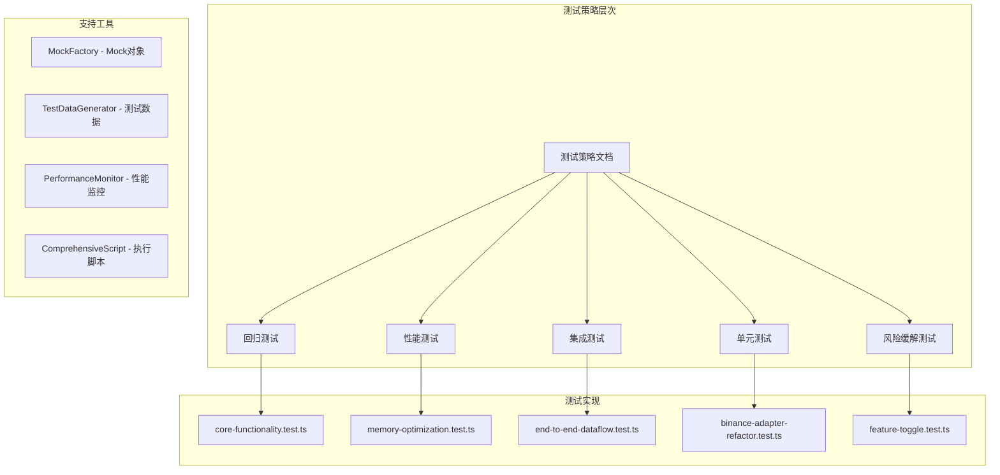

# Exchange Collector 重构测试策略执行套件

## 概述

这是Exchange Collector重构项目的完整测试策略实现，旨在确保重构过程中系统功能的完整性、性能目标的达成，以及风险的有效控制。

## 测试策略架构



## 目录结构

```
refactor-strategy/
├── tests/                          # 测试用例
│   ├── regression/                 # 回归测试
│   │   └── core-functionality.test.ts
│   ├── performance/                # 性能测试
│   │   └── memory-optimization.test.ts
│   ├── integration/                # 集成测试
│   │   └── end-to-end-dataflow.test.ts
│   ├── unit/                       # 单元测试
│   │   └── adapter-components.test.ts
│   ├── risk-mitigation/            # 风险缓解测试
│   │   ├── feature-toggle.test.ts
│   │   └── exception-recovery.test.ts
│   ├── phase1/                     # 阶段1测试
│   ├── phase2/                     # 阶段2测试
│   │   └── binance-adapter-refactor.test.ts
│   ├── phase3/                     # 阶段3测试
│   ├── utils/                      # 测试工具
│   │   ├── mock-factory.ts         # Mock工厂
│   │   └── performance-monitor.ts  # 性能监控器
│   └── fixtures/                   # 测试数据
│       └── test-data-generator.ts  # 测试数据生成器
├── scripts/                        # 执行脚本
│   └── run-comprehensive-tests.sh  # 完整测试套件执行脚本
├── reports/                        # 测试报告目录
├── package.json                    # 依赖配置
├── jest.config.js                 # Jest配置
├── setup.ts                       # 全局测试设置
└── README.md                      # 本文档
```

## 快速开始

### 1. 安装依赖

```bash
cd /workspaces/pixiu/services/data-collection/exchange-collector/tests/refactor-strategy
npm install
```

### 2. 运行完整测试套件

```bash
# 执行所有测试策略
./scripts/run-comprehensive-tests.sh

# 或者使用npm脚本
npm run test:comprehensive
```

### 3. 运行特定测试类型

```bash
# 回归测试
npm run test:regression

# 性能测试
npm run test:performance

# 集成测试
npm run test:integration

# 单元测试
npm run test:unit

# 风险缓解测试
npm run test:risk-mitigation

# 阶段测试
npm run test:phase1
npm run test:phase2
npm run test:phase3
```

## 测试策略详细说明

### 1. 回归测试策略

**目标**: 确保重构过程中现有功能不受影响

**覆盖范围**:
- WebSocket连接建立和数据接收
- Pub/Sub消息发布和订阅
- 多适配器并发处理
- API兼容性验证
- 数据流完整性检查

**执行方式**:
```bash
npm run test:regression
```

### 2. 性能测试策略

**目标**: 验证重构后性能目标达成
- 内存使用减少30%
- 消息处理吞吐量提升20%
- 延迟降低15%

**测试类型**:
- 内存泄漏检测
- 长时间运行稳定性
- 高并发处理能力
- 资源使用优化验证

**执行方式**:
```bash
# 需要启用垃圾回收器
export NODE_OPTIONS="--expose-gc"
npm run test:performance
```

### 3. 集成测试策略

**目标**: 验证组件间集成的正确性

**测试场景**:
- 端到端数据流测试
- 多适配器并发测试
- Pub/Sub和WebSocket集成
- 错误处理和重连机制

### 4. 单元测试策略

**目标**: 确保重构组件的单元功能正确

**覆盖要求**:
- 总体覆盖率 > 85%
- 重构组件覆盖率 > 95%
- 分支覆盖率 > 80%

### 5. 风险缓解测试

**目标**: 验证风险控制机制

**测试内容**:
- 特性开关功能
- 异常情况处理
- 数据一致性验证
- 回滚机制测试

### 6. 阶段测试

**目标**: 验证每个重构阶段的完成质量

**阶段划分**:
- **阶段1**: 架构分析验证
- **阶段2**: Adapter层重构验证
- **阶段3**: 消息流重构验证

## 测试工具和辅助类

### MockFactory

提供标准化的Mock对象创建：

```typescript
// 创建模拟的BinanceAdapter
const mockAdapter = MockFactory.createBinanceAdapter();

// 创建模拟的WebSocket连接
const mockWs = MockFactory.createWebSocketConnection();

// 创建模拟的Pub/Sub客户端
const mockPubSub = MockFactory.createPubSubClient();
```

### TestDataGenerator

生成各种类型的测试数据：

```typescript
// 生成市场数据
const marketData = TestDataGenerator.generateMarketData('kline', 'BTCUSDT');

// 生成批量数据
const batchData = TestDataGenerator.generateBatchMarketData(1000);

// 生成高频数据
const highFreqData = TestDataGenerator.generateHighFrequencyData(60000, 100);
```

### PerformanceMonitor

监控和分析性能指标：

```typescript
const monitor = new PerformanceMonitor();

// 开始监控
monitor.startMonitoring();

// 记录指标
monitor.recordLatency(latency);
monitor.recordMessage();

// 获取结果
const metrics = monitor.getMetrics();
```

## 性能基准和目标

### 内存使用目标
- **目标**: 减少30%内存使用
- **基准**: 重构前峰值内存使用量
- **验证**: `memory-optimization.test.ts`

### 吞吐量目标
- **目标**: 提升20%消息处理吞吐量
- **基准**: 重构前消息处理速率
- **验证**: 吞吐量基准测试

### 延迟目标
- **目标**: 降低15%端到端延迟
- **基准**: 重构前平均处理延迟
- **验证**: 延迟分布统计测试

## 质量门控

### 测试通过率
- **最低要求**: 95%测试通过率
- **推荐目标**: 99%测试通过率

### 代码覆盖率
- **最低要求**: 85%整体覆盖率
- **重构组件**: 95%覆盖率要求

### 性能要求
- **内存增长**: 单次运行内存增长 < 100MB
- **平均延迟**: < 50ms
- **P95延迟**: < 200ms

## 持续集成配置

### GitHub Actions示例

```yaml
name: Refactor Tests
on:
  pull_request:
    branches: [ master ]
  push:
    branches: [ refactor/* ]

jobs:
  refactor-tests:
    runs-on: ubuntu-latest
    steps:
      - uses: actions/checkout@v3
      
      - name: Setup Node.js
        uses: actions/setup-node@v3
        with:
          node-version: '18'
          cache: 'npm'
      
      - name: Install dependencies
        run: |
          cd services/data-collection/exchange-collector/tests/refactor-strategy
          npm ci
      
      - name: Run comprehensive tests
        run: |
          cd services/data-collection/exchange-collector/tests/refactor-strategy
          ./scripts/run-comprehensive-tests.sh
      
      - name: Upload test results
        uses: actions/upload-artifact@v3
        with:
          name: test-results
          path: services/data-collection/exchange-collector/tests/refactor-strategy/reports/
```

## 故障排除

### 常见问题

1. **Jest进程挂起**
   - 确保所有测试文件包含`globalCache.destroy()`
   - 检查未关闭的异步操作

2. **内存测试不稳定**
   - 确保启用垃圾回收器：`export NODE_OPTIONS="--expose-gc"`
   - 增加测试超时时间

3. **Mock对象不工作**
   - 检查Jest配置中的`setupFilesAfterEnv`
   - 确保正确导入Mock工厂

### 调试技巧

```bash
# 启用详细输出
npm run test:regression -- --verbose

# 运行单个测试文件
npm test -- tests/regression/core-functionality.test.ts

# 监视模式
npm run test:watch

# 生成覆盖率报告
npm run test:coverage
```

## 贡献指南

### 添加新测试

1. 确定测试类型（回归/性能/集成/单元/风险缓解）
2. 在相应目录创建测试文件
3. 使用提供的工具类（MockFactory, TestDataGenerator等）
4. 遵循测试命名规范
5. 更新相关文档

### 测试命名规范

- 测试文件：`*.test.ts`
- 测试描述：使用中文描述业务场景
- 分组：按功能模块分组

### 代码风格

- 使用TypeScript
- 遵循项目ESLint配置
- 添加适当的类型注解
- 包含必要的注释

## 许可证

本测试策略遵循项目的MIT许可证。